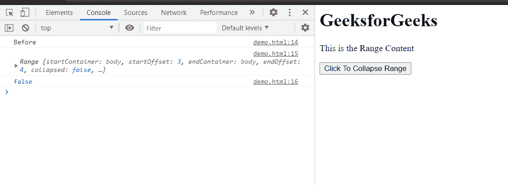

# HTML DOM 范围折叠()方法

> 原文:[https://www . geesforgeks . org/html-DOM-range-collapse-method/](https://www.geeksforgeeks.org/html-dom-range-collapse-method/)

**折叠()**方法将范围折叠到其边界点之一。

折叠区域是一个空区域，不包含任何内容。

**语法:**

```html
range.collapse(boolean);
```

**参数:**该方法以布尔值为参数。

*   **真:**将范围缩小至其起点。
*   **false:** 将范围折叠到其末端。

**返回值:**这个方法没有返回值。

**示例:**此示例显示了如何使用此方法折叠范围。折叠属性用于检查范围是否折叠。

## 超文本标记语言

```html
<!DOCTYPE html>
<html>

<head>
    <title>
        HTML DOM range 
        collapse() method
    </title>
</head>

<body>
    <h1>GeeksforGeeks</h1>

    <p>This is the Range Content</p>

    <button onclick="collapse()">
        Click To Collapse Range
    </button>

    <script>
        let range = document.createRange();
        let referenceNode = document.
            getElementsByTagName('p').item(0);
        range.selectNode(referenceNode);
        console.log("Before")
        console.log(range);
        console.log(range.collapsed);
        function collapse() {
            console.log("After")
            range.collapse(true);
            console.log(range);
            console.log(range.collapsed);
        }
    </script>
</body>

</html>
```

**输出:**在控制台中，我们可以看到使用这种方法的范围是折叠的。

*   **点击按钮前:**

    

*   **点击按钮后:**

    

    可以看到，折叠后，开始偏移和结束偏移现在设置为 3

**支持的浏览器:**DOM Range collapse()方法支持的浏览器如下:

*   谷歌 Chrome
*   边缘
*   火狐浏览器
*   旅行队
*   歌剧