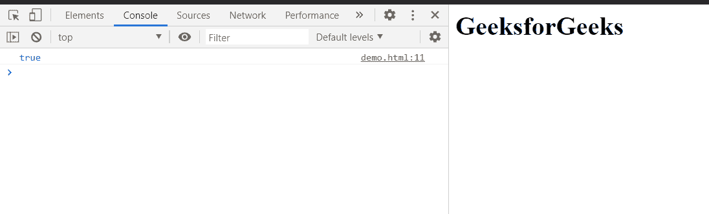
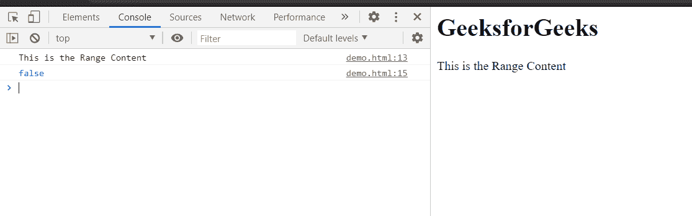

# HTML DOM Range 折叠属性

> 原文:[https://www . geesforgeks . org/html-DOM-range-collapsed-property/](https://www.geeksforgeeks.org/html-dom-range-collapsed-property/)

**折叠的**属性返回一个布尔值，指示范围的**起点**和**终点**是否在同一位置。如果范围的起点和终点相同，则返回**真**，否则返回**假**。这是只读属性。

折叠区域是一个空区域，不包含任何内容。

**语法:**

```html
val = range.collapsed;
```

**返回值:**该属性的返回值为:

*   **真:**当范围的起点和终点相同时。
*   **假:**当范围的起点和终点不同时。

**例 1:** 当范围的起点和终点相同时。

## 超文本标记语言

```html
<!DOCTYPE html>
<html>

<head>
    <title>
        HTML DOM range
        collapsed property
    </title>
</head>

<body>
    <h1>GeeksforGeeks</h1>

    <script>
        let range = document.createRange();
        val = range.collapsed;
        console.log(val);
    </script>
</body>

</html>
```

**输出:**这里范围没有内容，所以这个属性会在控制台返回**真**。



**例 2:** 当范围的起点和终点不同时。

在这个例子中，我们给了范围一些内容，然后应用这个属性得到**假值。**

## 超文本标记语言

```html
<!DOCTYPE html>
<html>

<head>
    <title>
        HTML DOM range 
        collapsed property
    </title>
</head>

<body>
    <h1>GeeksforGeeks</h1>

    <p>This is the Range Content</p>

    <script>
        let range = document.createRange();
        let referenceNode = document
            .getElementsByTagName('p').item(0);
        range.selectNode(referenceNode);
        console.log(range.toString());
        val = range.collapsed;
        console.log(val);
    </script>
</body>

</html>
```

**输出:**在控制台，可以看到数值。



**支持的浏览器:**DOM Range 折叠属性支持的浏览器如下:

*   谷歌 Chrome
*   边缘
*   火狐浏览器
*   旅行队
*   歌剧
*   微软公司出品的 web 浏览器