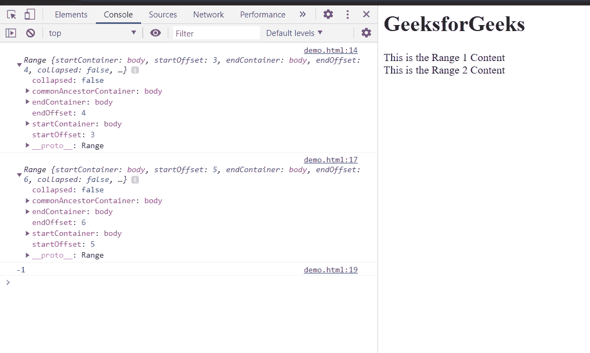

# HTML DOM Range compareboundrypoints()方法

> 原文:[https://www . geeksforgeeks . org/html-DOM-range-compareboundrypoints-method/](https://www.geeksforgeeks.org/html-dom-range-compareboundarypoints-method/)

**compareboundrypoints()**方法用于将**一个范围**的边界点与**另一个范围的边界点进行比较。**

**语法:**

```html
compare = firstRange.compareBoundaryPoints(comparision_method, otherRange);

```

**返回值:**该方法返回一个数字，表示边界点的位置:

*   **-1 :** 如果第一范围的边界点位于第二范围的边界点之前**，则返回-1。**
*   **0 :** 如果第一范围的边界点位于**等于**第二范围的边界点，则返回 0。
*   **1 :** 如果第一个范围的边界点位于第二个范围的边界点之后**，则返回 1。**

**参数:**该方法包含 2 个参数:

**1。**描述比较方法的常数:

*   **范围。END_TO_END** 比较第一范围的结束边界点和第二范围的结束边界点。
*   **范围。结束至开始**比较第一范围的结束边界点和第二范围的开始边界点。
*   **范围。开始到结束**比较第一范围的开始边界点和第二范围的结束边界点。
*   **范围。开始到开始**比较第一范围的开始边界点和第二范围的开始边界点。

**2。其他范围:**用于比较的其他范围。

**示例:**在示例中，我们将创建并比较两个范围。

## 超文本标记语言

```html
<html>
<head>
<title>HTML DOM range compareBoundaryPoints() method</title>   
</head>
<body>
    <h1>GeeksforGeeks</h1>
    <div>This is the Range 1 Content</div>
    <div>This is the Range 2 Content</div>
</body>
<script>
    var range1, range2, compare;
  range1 = document.createRange();
  range1.selectNode(document.getElementsByTagName("div")[0]);
  console.log(range1);
  range2 = document.createRange();
  range2.selectNode(document.getElementsByTagName("div")[1]);
  console.log(range2);
  compare = range1.compareBoundaryPoints(Range.START_TO_END, range2);
  console.log(compare);
</script>
</html>
```

**输出:**在控制台中，我们可以看到两个范围以及这些范围的记录比较。

输出为-1，因为范围 1 的起始偏移量为 3，范围 2 的结束偏移量为 6。



**支持的浏览器:**DOM compareBoundaryPoints()方法支持的浏览器如下:

*   谷歌 Chrome
*   边缘
*   火狐浏览器
*   旅行队
*   歌剧
*   微软公司出品的 web 浏览器