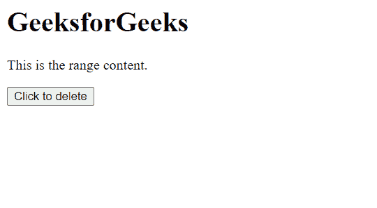
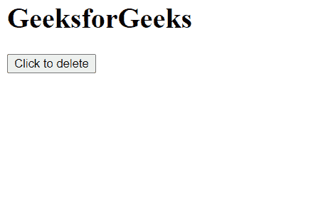

# HTML DOM 范围删除内容()方法

> 原文:[https://www . geesforgeks . org/html-DOM-range-delete contents-method/](https://www.geeksforgeeks.org/html-dom-range-deletecontents-method/)

**删除内容()**方法从**文档树**中删除范围的所有内容。

**语法:**

```html
range.deleteContents()
```

**参数:**此方法不接受任何参数。

**返回值:**此方法不返回值。

**示例:**本示例介绍如何从文档树中删除当前范围。

## 超文本标记语言

```html
<!DOCTYPE html>
<html>

<head>
    <title>
        HTML DOM range deleteContents() method
    </title>
</head>

<body>
    <h1>GeeksforGeeks</h1>

    <p>This is the range content.</p>

    <button onclick="del()">
        Click to delete
    </button>

    <script>
        var range = document.createRange();
        range.selectNode(document
            .getElementsByTagName("p").item(0));

        function del() {
            range.deleteContents();
        }
    </script>
</body>

</html>
```

**输出:**

*   **点击按钮前:**

    

*   **点击按钮后:**

    

**支持的浏览器:**

*   谷歌 Chrome
*   边缘
*   火狐浏览器
*   旅行队
*   歌剧
*   微软公司出品的 web 浏览器