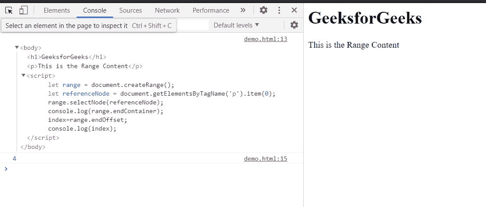

# HTML DOM 范围内集合属性

> 原文:[https://www . geesforgeks . org/html-DOM-range-endofset-property/](https://www.geeksforgeeks.org/html-dom-range-endoffset-property/)

**endofset**属性返回一个代表范围结束的偏移索引的数字。这是只读属性。

如果范围的父节点是文本类型的节点，则偏移索引将是范围结束字符的索引。对于其他节点类型，endOffset 是父节点结尾的子节点的**索引**。

**语法:**

```html
end = range.endOffset;

```

**返回值:**返回范围结束的偏移索引。

**示例:**在本例中，我们将使用该属性获取 endOffset 索引。

这里，范围的 endOffset 索引是 endContainer 节点的第 4 个节点。

## 超文本标记语言

```html
<html>
<head>
<title>HTML DOM range endOffset property</title>   
</head>
<body>
    <h1>GeeksforGeeks</h1>

<p>This is the Range Content</p>

</body>
<script>
    let range = document.createRange();
    let referenceNode = document.getElementsByTagName('p').item(0);
    range.selectNode(referenceNode);
    console.log(range.endContainer);
    index=range.endOffset;
    console.log(index);
</script>
</html>
```

**输出:**在控制台中，可以看到结束设置索引。



**支持的浏览器:**

*   谷歌 Chrome
*   边缘
*   火狐浏览器
*   旅行队
*   歌剧
*   微软公司出品的 web 浏览器