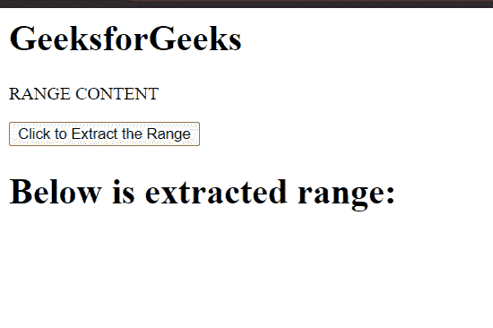
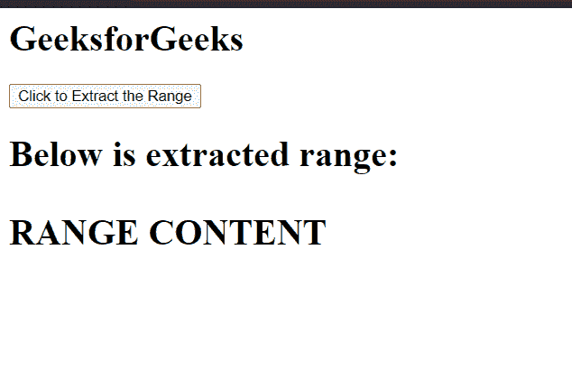

# HTML DOM 范围提取内容()方法

> 原文:[https://www . geesforgeks . org/html-DOM-range-extract contents-method/](https://www.geeksforgeeks.org/html-dom-range-extractcontents-method/)

**提取内容()**方法将**范围**的内容从文档树移动到**文档对象变量**中。**范围**的内容从文档树中移除。

**提取内容()**方法类似于**克隆内容()**方法。**提取内容()**方法从范围对象的内容中创建**文档片段对象**，并从文档树中移除**范围**的内容。

**语法:**

```html
documentFragment = range.extractContents();
```

**参数:**此方法不接受任何参数。

**返回值:**该方法返回一个从范围内容创建的**文档片段**对象。

**示例:**这个示例展示了如何使用这个方法创建一个 DocumentFragment 对象并将其追加到一个元素中。

## 超文本标记语言

```html
<!DOCTYPE html>
<html>

<head>
    <title>
        HTML DOM range extractContents() method
    </title>
</head>

<body>
    <h1>GeeksforGeeks</h1>

    <p>RANGE CONTENT</p>

    <button onclick="extract()">
        Click to Extract the Range
    </button>

    <h1 id="element">
        Below is extracted range: 
    </h1>

    <script>
        var range = document.createRange();

        range.selectNode(document
            .getElementsByTagName("p").item(0));

        const element = 
            document.getElementById('element');

        function extract() {
            var documentFragment = 
                    range.extractContents();

            console.log(documentFragment);
            element.appendChild(documentFragment);
        }
    </script>
</body>

</html>
```

**输出:**

*   **点击按钮前:**

    

*   **点击按钮后:**

    

**支持的浏览器:**

*   谷歌 Chrome
*   边缘
*   火狐浏览器
*   旅行队
*   歌剧
*   微软公司出品的 web 浏览器