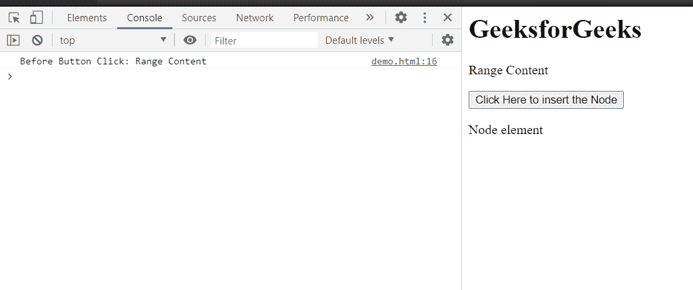
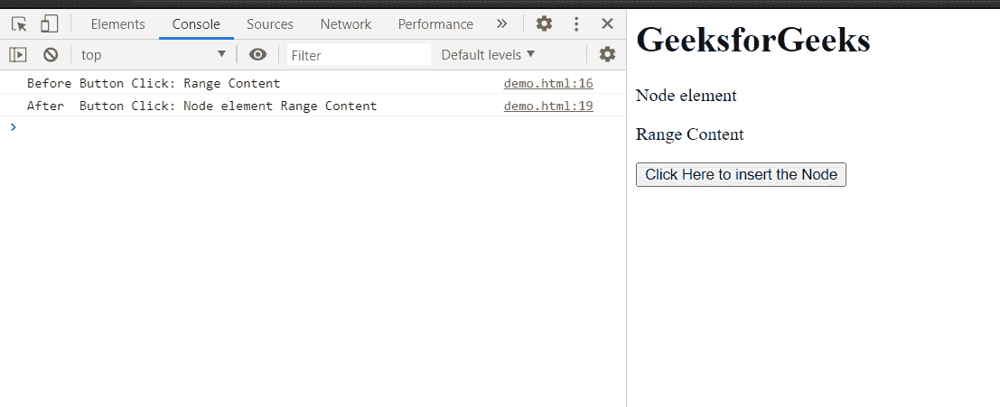

# HTML DOM 范围插入节点()方法

> 原文:[https://www . geesforgeks . org/html-DOM-range-insert node-method/](https://www.geeksforgeeks.org/html-dom-range-insertnode-method/)

**插入节点()**方法**在范围的开始处插入**一个节点。

更新的范围由最后一个范围内容的范围之前的新插入节点组成。

**语法:**

```html
range.insertNode( newNode );
```

**参数:**该方法接受如上所述的单个参数，描述如下:

*   **新节点:**要在范围开始处插入的节点。

**返回值:**此方法不返回值。

**示例:**本示例展示了如何使用 **insertNode()** 方法在范围内容前插入节点。为了澄清范围内容的变化，我们已经使用 **toString()** 方法在字符串文本中控制台记录了新的范围。

## 超文本标记语言

```html
<!DOCTYPE html>
<html>

<head>
    <title>
        HTML DOM range insertNode() method
    </title>
</head>

<body>
    <h1>GeeksforGeeks</h1>

    <p>Range Content</p>

    <button onclick="insert()">
        Click Here to insert the Node
    </button>

    <p id="element">Node element </p>

    <script>
        var range = document.createRange();
        range.selectNode(document
            .getElementsByTagName("p").item(0));

        const element = document
            .getElementById('element');

        console.log("Before Button Click:", 
                            range.toString());

        function insert() {
            range.insertNode(element);
            console.log("After  Button Click:", 
                            range.toString());
        }
    </script>
</body>

</html>
```

**输出:**

*   **点击按钮前:**

    

*   **点击按钮后:**

    

**支持的浏览器:**

*   谷歌 Chrome
*   边缘
*   火狐浏览器
*   旅行队
*   歌剧
*   微软公司出品的 web 浏览器