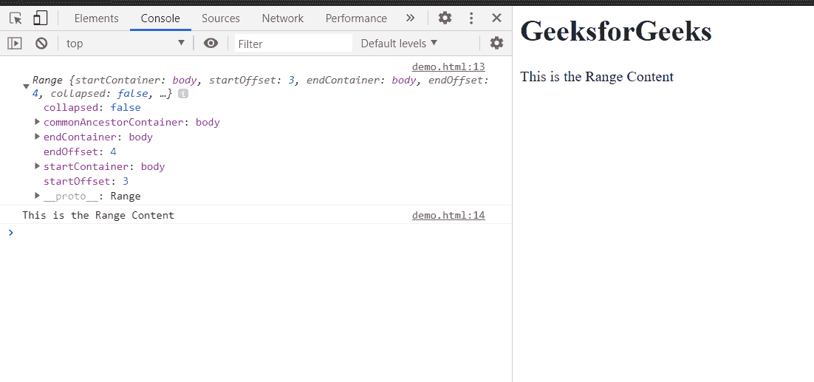

# HTML DOM 范围选择节点()方法

> 原文:[https://www . geesforgeks . org/html-DOM-range-selectnode-method/](https://www.geeksforgeeks.org/html-dom-range-selectnode-method/)

**选择节点()**方法将**范围**内容设置为包含节点。范围的开始和结束将与**参考代码**相同。

**语法:**

```html
range.selectNode(referenceNode);

```

**参数:**

*   **引用节点:**设置范围内容的节点。

**返回值:**这个方法没有返回值。

**示例:**本示例展示了如何使用该方法设置范围的内容。

为了更好地说明，控制台通过 **toString()** 方法在字符串文本中记录了新的范围内容。

## 超文本标记语言

```html
<html>
<head>
<title>HTML DOM range selectNode() method</title>   
</head>
<body>
    <h1>GeeksforGeeks</h1>

<p>This is the Range Content</p>

</body>
<script>
    let range = document.createRange();
    let referenceNode = document.getElementsByTagName('p').item(0);
    range.selectNode(referenceNode);
    console.log(range);
    console.log(range.toString());
</script>
</html>
```

**输出:**在控制台，可以看到范围内容。



**支持的浏览器:**

*   谷歌 Chrome
*   边缘
*   火狐浏览器
*   旅行队
*   歌剧
*   微软公司出品的 web 浏览器