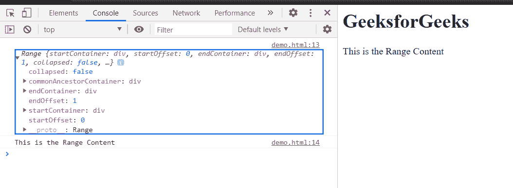

# HTML DOM 范围选择节点内容()方法

> 原文:[https://www . geesforgeks . org/html-DOM-range-selectnodecents-method/](https://www.geeksforgeeks.org/html-dom-range-selectnodecontents-method/)

**选择节点内容()**方法设置包含节点内容的范围。

**开始偏移量**每次为 0，**结束偏移量**可以是子节点数，也可以是引用节点中包含的字符数。

**语法:**

```html
range.selectNodeContents(referenceNode);
```

**参数:**

*   **引用节点:**其内容将设置范围内容的节点。

**返回值:**这个方法没有返回值。

**示例:**本示例展示了如何使用该方法设置范围的内容。

为了更好地说明该示例，控制台通过 **toString()** 方法记录了字符串文本中的范围内容。

## 超文本标记语言

```html
<!DOCTYPE html>
<html>

<head>
    <title>
        HTML DOM range selectNodeContents() method
    </title>
</head>

<body>
    <h1>GeeksforGeeks</h1>
    <div>This is the Range Content</div>

    <script>
        var range;
        range = document.createRange();
        range.selectNodeContents(
            document.getElementsByTagName("div")[0]);
        console.log(range);
        console.log(range.toString());
    </script>
</body>

</html>
```

**输出:**在控制台，可以看到范围。



**支持的浏览器:**DOM SelectNodeContents()方法支持的浏览器如下:

*   谷歌 Chrome
*   边缘
*   火狐浏览器
*   旅行队
*   歌剧
*   微软公司出品的 web 浏览器