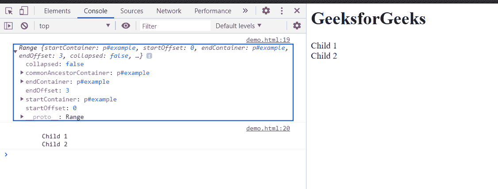
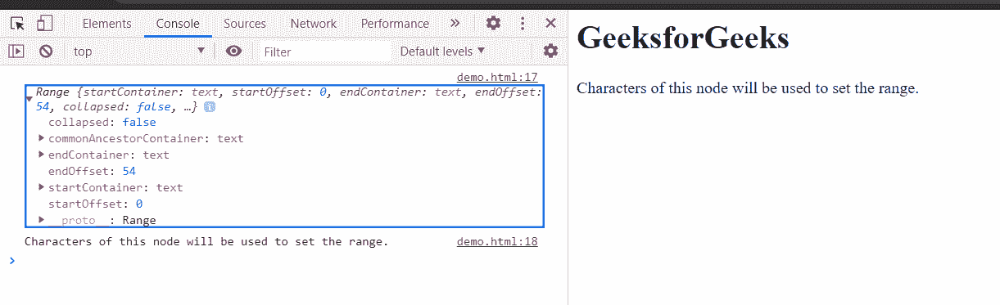

# HTML DOM 范围设置 End()方法

> 原文:[https://www.geeksforgeeks.org/html-dom-range-setend-method/](https://www.geeksforgeeks.org/html-dom-range-setend-method/)

**设置结束()方法**用于设置**范围**的**结束位置**。

**endNode** 可用作文本节点、子节点等。 **endOffset** 可以是 **endNode** 的字符数，也可以是 **endNode** 的**子节点**的数量。

**语法:**

```html
range.setEnd(endNode, endOffset);
```

**参数:**该方法接受两个参数，如上所述，如下所述:

*   **结束节点:**用于设置范围结束的节点。
*   **结束偏移设置:**此参数是大于或等于零的偏移索引，代表范围结束的索引。

**返回值:**此方法不返回值。

**示例 1:** 本示例将范围的结尾设置为父节点的子节点。

本示例使用 **setEnd()** 方法设置范围的结束子节点。在这里，我们使用了 **setStart()** 方法来设置范围的起点，以完全组成一个范围。为了清楚定义范围，我们已经使用**到字符串()**方法将选定范围转换为文本。

## 超文本标记语言

```html
<!DOCTYPE html>
<html>

<head>
    <title>
        HTML DOM range setEnd() method
    </title>
</head>

<body>
    <h1>GeeksforGeeks</h1>

    <p id="exampleNode">
        Child 1<br>
        Child 2<br>
    </p>

    <script>
        const exampleNode = document
            .getElementById('exampleNode');

        const range = document.createRange();

        // 0th child gets at starting
        // of the range
        range.setStart(exampleNode, 0);

        // 3rd child gets at ending
        // of the range
        range.setEnd(exampleNode, 3);
        console.log(range);
        console.log(range.toString());
    </script>
</body>

</html>
```

**输出:**在控制台中，可以看到创建的范围。



**示例 2:** 本示例将范围的结尾设置为文本节点的字符。

## 超文本标记语言

```html
<!DOCTYPE html>
<html>

<head>
    <title>
        HTML DOM range setEnd() method
    </title>
</head>

<body>
    <h1>GeeksforGeeks</h1>

    <p id="exampleNode">
        Characters of this node will 
        be used to set the range.
    </p>

    <script>
        const exampleNode = document
            .getElementById('exampleNode');

        const textNode = exampleNode.childNodes[0];
        const range = document.createRange();

        // Starting of range will be 0th character
        range.setStart(textNode, 0);

        // Ending of range will be 54th character
        range.setEnd(textNode, 54);
        console.log(range);
        console.log(range.toString())
    </script>
</body>

</html>
```

**输出:**在控制台中，可以看到创建的范围。



**支持的浏览器:**

*   谷歌 Chrome
*   边缘
*   火狐浏览器
*   旅行队
*   歌剧