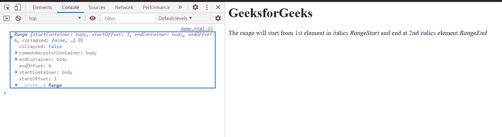

# HTML DOM 范围设置后()方法

> 原文:[https://www . geesforgeks . org/html-DOM-range-setendafter-method/](https://www.geeksforgeeks.org/html-dom-range-setendafter-method/)

Range **setEndAfter()** 方法用于设置一个范围相对于另一个节点的结束位置。用于设置结束点范围的元素是 referenceNode 元素。该方法使用参考元素，其含量为范围内包含的**。**

****语法:****

```html
range.setEndAfter( refNode );
```

****参数:****

*   ****参考节点:**设置范围结束的节点。**

****返回值:**此方法不返回值。**

****示例:**本示例介绍如何设置范围的结束位置。同样在这个例子中，我们使用了**设置开始前()**方法来设置范围的开始。结束引用节点是文档的第二个**<I>**元素。**

## **超文本标记语言**

```html
<!DOCTYPE html>
<html>

<body>
    <h1>GeeksforGeeks</h1>

    The range will start from 1st
    element in italics <i> RangeStart</i>
    and end at 2nd italics element
    <i>RangeEnd</i>

    <script>
        var range = document.createRange();
        var startNode = document
            .getElementsByTagName("i").item(0);

        var endNode = document
            .getElementsByTagName("i").item(1);

        range.setStartBefore(startNode);
        range.setEndAfter(endNode);
        console.log(range);
    </script>
</body>

</html>
```

****输出:**在控制台中，可以看到创建的范围。**

****

****支持的浏览器:****

*   **谷歌 Chrome**
*   **边缘**
*   **火狐浏览器**
*   **旅行队**
*   **歌剧**