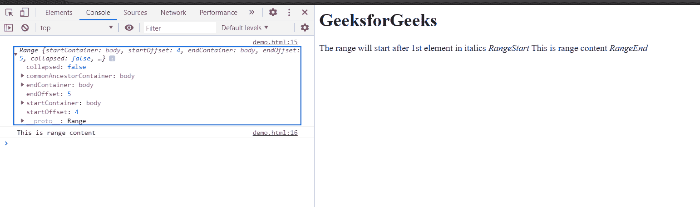

# HTML DOM Range setEndBefore()方法

> 原文:[https://www . geesforgeks . org/html-DOM-range-setendbefore-method/](https://www.geeksforgeeks.org/html-dom-range-setendbefore-method/)

范围**设置结束前()**方法设置一个范围相对于另一个节点的结束位置。用于设置终点范围的元素是**参考节点**元素。在该方法中，所用的参考元素及其含量是不包括在范围内的**。**

****语法:****

```html
range.setEndBefore(refNode); 
```

****参数:****

*   ****引用节点元素:**设置范围结束的节点。**

****返回值:**这个方法没有返回值。**

****示例:**本示例将展示如何使用 **setEndBefore()方法**设置范围的结束位置。同样在这个例子中，我使用了**设置开始时间()方法来设置范围的开始时间。**结束参考节点**这里是文档的**第二个< i >元素**。****

**作为参考，我还在文本中记录了范围，以使其清晰。**

```html
<html>
<head>
<title>HTML DOM range setEndBefore() property</title>    
</head>
<body>
    <h1>GeeksforGeeks</h1>
    The range will start after 1st element in 
italics<i> RangeStart</i> This is range content 
<i>RangeEnd</i>
</body>
<script>
    var range = document.createRange();
    var refNode1 = document.getElementsByTagName("i").item(0);
    var refNode2 = document.getElementsByTagName("i").item(1);
    range.setStartAfter(refNode1);
    range.setEndBefore(refNode2);
    console.log(range);
    console.log(range.toString())
</script>
</html>
```

****输出:**在控制台中，可以看到用 startOffset 和 endOffset 制作的范围。**

****

****支持的浏览器:****

*   **谷歌 Chrome**
*   **边缘**
*   **火狐浏览器**
*   **旅行队**
*   **歌剧**