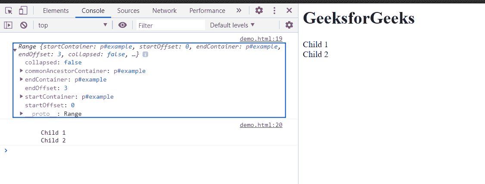

# HTML DOM 范围设置开始()方法

> 原文:[https://www . geesforgeks . org/html-DOM-range-set start-method/](https://www.geeksforgeeks.org/html-dom-range-setstart-method/)

**设置开始()方法**用于设置**范围**的开始位置。**开始节点**可以用作文本节点、子节点等。 **startOffset** 可以是从 **startNode** 开始的字符数，也可以是 **startNode** 开始之间的子节点数。

**语法:**

```html
range.setStart(startNode, startOffset);
```

**参数:**

*   **开始节点:**用于开始范围的节点。
*   **起始偏移量:**此参数是大于或等于零的**偏移量索引**，表示从起始节点开始的范围的索引。

**返回值:**此方法不返回值。

**例 1:** 在本例中，设置父节点的范围子节点的起点。

本示例使用 **setStart()方法**设置范围的起始子节点。在这里，我们使用了**设置结束()方法**来设置范围的结束。为了清楚定义范围，我们已经使用**到字符串()**方法将选定范围转换为文本。

## 超文本标记语言

```html
<!DOCTYPE html>
<html>

<body>
    <h1>GeeksforGeeks</h1>
    <p id="parent">
        Child 1<br>
        Child 2<br>
    </p>

    <script>
        const example = document
            .getElementById('parent');

        const range = document.createRange();
        range.setStart(example, 0);
        range.setEnd(example, 3);
        console.log(range);
        console.log(range.toString());
    </script>
</body>

</html>
```

**输出:**在控制台中，可以看到创建的范围。



**例 2:** 在本例中，通过获取文本节点的字符来设置范围的开始。

## 超文本标记语言

```html
<!DOCTYPE html>
<html>

<body>
    <h1>GeeksforGeeks</h1>

    <p id="example">
        Characters of this node will
        be used to set the range.
    </p>

    <script>
        const example = document
            .getElementById('example');

        const textNode = example.childNodes[0];
        const range = document.createRange();

        // Starting of range will 
        // be 0th character
        range.setStart(textNode, 0);

        // Ending of range will be 
        // 54th character
        range.setEnd(textNode, 54);
        console.log(range);
        console.log(range.toString())
    </script>
</body>

</html>
```

**输出:**在控制台中，可以看到创建的范围。


**支持的浏览器:**

*   谷歌 Chrome
*   边缘
*   火狐浏览器
*   旅行队
*   歌剧