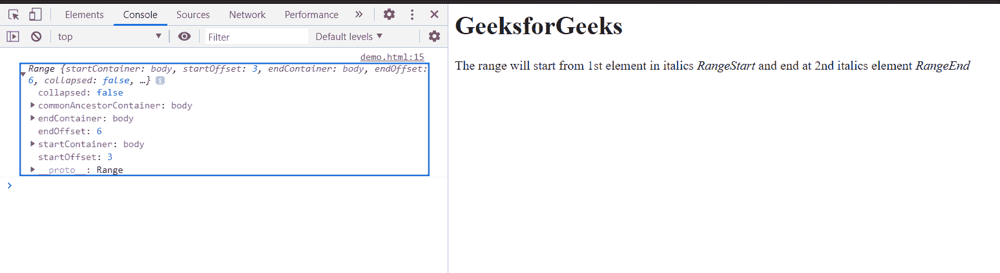

# HTML DOM 范围设置开始前()方法

> 原文:[https://www . geesforgeks . org/html-DOM-range-set start before-method/](https://www.geeksforgeeks.org/html-dom-range-setstartbefore-method/)

HTML DOM Range**setStartBefore()**方法用于设置一个 Range 的起始位置。用于设置起点范围的元素是 referenceNode 元素。在此方法中，参考元素也包含在范围内。

**语法:**

```html
range.setStartBefore( refNode );
```

**参数:**

*   **参考节点:**设置范围起始位置的节点。

**返回值:**此方法不返回值。

**示例:**本示例介绍如何设置范围的起点。同样在这个例子中，我们使用了 **setEndAfter()** 方法来设置范围的结束。**开始参考节点**是文档的第一个**I>元素**。

## 超文本标记语言

```html
<!DOCTYPE html>
<html>

<body>
    <h1>GeeksforGeeks</h1>

    The range will start from 1st 
    element in italics <i> RangeStart</i> 
    and end at 2nd italics element
    <i>RangeEnd</i>

    <script>
        var range = document.createRange();
        var refNode1 = document
            .getElementsByTagName("i").item(0);

        var refNode2 = document
            .getElementsByTagName("i").item(1);

        range.setStartBefore(refNode1);
        range.setEndAfter(refNode2);
        console.log(range);
    </script>
</body>

</html>
```

**输出:**在控制台中，可以看到创建的范围。



**支持的浏览器:**

*   谷歌 Chrome
*   边缘
*   火狐浏览器
*   旅行队
*   歌剧