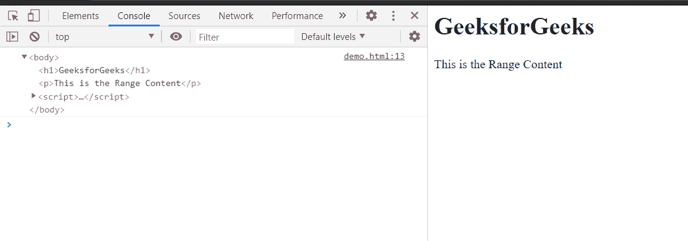

# HTML DOM Range startContainer 属性

> 原文:[https://www . geesforgeks . org/html-DOM-range-start container-property/](https://www.geeksforgeeks.org/html-dom-range-startcontainer-property/)

**startContainer** 属性返回当前范围**开始**的父**节点**。这是一个只读属性**。**

**语法:**

```html
ParentNode = range.startContainer;

```

**返回值:**

*   返回当前范围开始的节点。

**示例:**这个示例将展示如何获取当前范围的 startContainer 节点。

## 超文本标记语言

```html
<html>
<head>
<title>HTML DOM range startContainer property</title>   
</head>
<body>
    <h1>GeeksforGeeks</h1>

<p>This is the Range Content</p>

</body>
<script>
    let range = document.createRange();
    let referenceNode = document.getElementsByTagName('p').item(0);
    range.selectNode(referenceNode);
    console.log(range.startContainer);
</script>
</html>
```

**输出:**在控制台中，我们获得了我们范围内的 startContainer 节点。



**支持的浏览器:**

*   谷歌 Chrome
*   边缘
*   火狐浏览器
*   旅行队
*   歌剧
*   微软公司出品的 web 浏览器