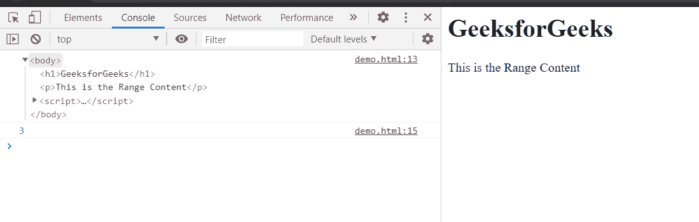

# HTML DOM 范围开始偏移量属性

> 原文:[https://www . geesforgeks . org/html-DOM-range-start offset-property/](https://www.geeksforgeeks.org/html-dom-range-startoffset-property/)

**startOffset** 属性返回一个数字，代表范围开始的偏移索引。这是只读属性。

如果范围的**父节点**是文本类型的节点，那么偏移索引将是从范围开始的字符数。对于其他节点类型，**开始偏移量**是从开始容器父节点开始的子节点数。

**语法:**

```html
start = range.startOffset;

```

**返回值:**返回范围起始的偏移索引。

**示例:**在本例中，我们将使用该属性获取 startOffset 索引。

这里是从 startContainer 节点开始的第三个节点中的范围的 startOffset 索引。

## 超文本标记语言

```html
<html>
<head>
<title>HTML DOM range startOffset property</title>   
</head>
<body>
    <h1>GeeksforGeeks</h1>

<p>This is the Range Content</p>

</body>
<script>
    let range = document.createRange();
    let referenceNode = document.getElementsByTagName('p').item(0);
    range.selectNode(referenceNode);
    console.log(range.startContainer);
    index=range.startOffset;
    console.log(index);
</script>
</html>
```

**输出:**在控制台中，可以看到 startOffset 索引。



**支持的浏览器:**

*   谷歌 Chrome
*   边缘
*   火狐浏览器
*   旅行队
*   歌剧
*   微软公司出品的 web 浏览器