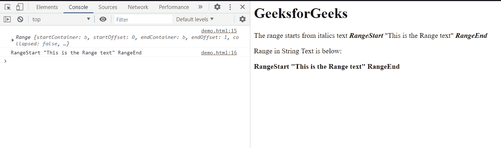

# HTML DOM 范围 toString()方法

> 原文:[https://www . geesforgeks . org/html-DOM-range-tostring-method/](https://www.geeksforgeeks.org/html-dom-range-tostring-method/)

范围**到字符串()**方法用于将**范围转换为字符串文本**。所选范围是需要转换为文本的对象，所以使用此方法。

**语法:**

```html
Range.toString();
```

**参数:**此方法不接受任何参数。

**返回值:**该方法返回指定范围的字符串文本。

**示例:**此示例显示如何将范围转换为字符串文本。我们使用**设置开始前()**方法和**设置结束后()**方法为我们的示例设置范围。

## 超文本标记语言

```html
<!DOCTYPE html>
<html>

<head>
    <title>
        HTML DOM range toString() property
    </title>
</head>

<body>
    <h1>GeeksforGeeks</h1>

    <p>
        The range starts from italics 
        text <b><i>RangeStart</i></b> 
        "This is the Range text" <b>
        <i>RangeEnd</i></b>
    </p>

    Range in String Text is below: 
    <b><p id="text"></p></b>

    <script>
        const range = document.createRange();
        range.setStartBefore(document
            .getElementsByTagName('i').item(0));

        range.setEndAfter(document
            .getElementsByTagName('i').item(1));

        document.getElementById('text')
            .innerHTML = range.toString();

        console.log(range);
        console.log(range.toString());
    </script>
</body>

</html>
```

**输出:**文本元素的内部 HTML 包含文本格式的范围。

作为参考，范围对象和文本范围记录在控制台中，以便更好地说明此方法。



**支持的浏览器:**

*   谷歌 Chrome
*   边缘
*   火狐浏览器
*   苹果 Safari
*   歌剧