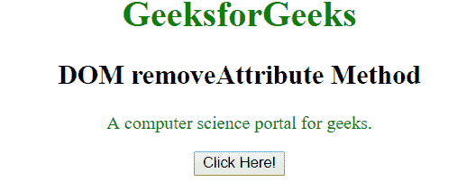
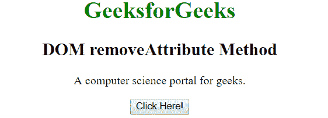

# HTML | DOM removeAttribute()方法

> 原文:[https://www . geesforgeks . org/html-DOM-remove attribute-method/](https://www.geeksforgeeks.org/html-dom-removeattribute-method/)

**DOM removeAttribute()** 方法用于从元素中移除具有指定名称的属性。与 **removeAttributeNode()** 方法类似，不同的是 removeAttributeNode 方法用于移除指定的属性对象，但另一方面 *removeAttribute* 移除指定名称的属性。

**语法:**

```html
element.removeAttribute(name)
```

其中**名称**是指定要从元素中移除的属性名称的字符串。这是必填字段。

**示例:**

```html
<!DOCTYPE html>
<html>

<head>
    <title>
      HTML DOM removeAttribute Method
    </title>
    <style>
        .gfg {
            color: green;
        }
    </style>
</head>

<body style="text-align: center;">
    <h1 style="color:green;">
       GeeksforGeeks
    </h1>

    <h2>
       DOM removeAttribute Method
    </h2>

    <p id="p" class="gfg">
       A computer science portal for geeks.
    </p>

    <button onclick="Geeks()">
        Click Here!
    </button>

    <script>
        function Geeks() {
            //Remove class attributes from 'p' element. 
            document.getElementById(
                "p").removeAttribute("class");
        }
    </script>
</body>

</html>
```

**输出:**

**之前点击按钮:**


**点击按钮后:**


**支持的浏览器:**remove attribute()方法支持的浏览器如下:

*   谷歌 Chrome
*   微软公司出品的 web 浏览器
*   火狐浏览器
*   歌剧
*   旅行队