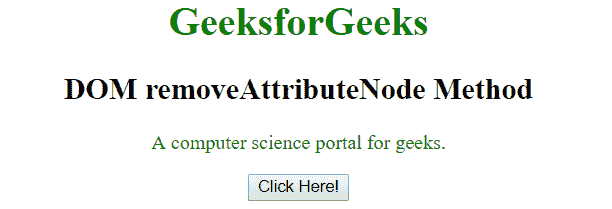
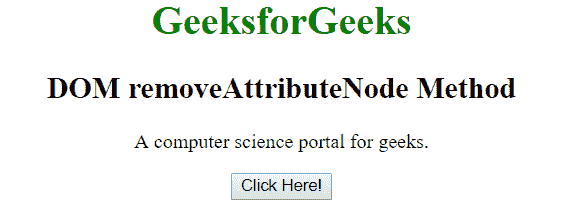

# HTML | DOM removeAttributeNode()方法

> 原文:[https://www . geesforgeks . org/html-DOM-removeattributenode-method/](https://www.geeksforgeeks.org/html-dom-removeattributenode-method/)

**DOM removeAttributeNode()** 方法用于从当前元素中移除指定的属性。与 **removeAttribute()** 方法类似，不同的是 **removeAttribute** 方法用于移除指定名称的属性，但另一方面 *removeAttributeNode* 移除指定的属性对象。

**语法:**

```html
element.removeAttributeNode(name)
```

其中**名称**是要移除的属性节点。这是必填字段。

**返回值:**返回要删除的属性节点。

**示例:**

```html
<!DOCTYPE html>
<html>

<head>
    <title>HTML DOM removeAttributeNode Method</title>
    <style>
        .gfg {
            color: green;
        }
    </style>
</head>

<body style="text-align: center;">
    <h1 style="color:green;">
            GeeksforGeeks
        </h1>

    <h2>
            DOM removeAttributeNode Method
        </h2>

    <p id="p" class="gfg">
      A computer science portal for geeks.
    </p>

    <button onclick="Geeks()">Click Here!</button>

    <script>
        function Geeks() {
            var d = document.getElementById("p");
            var color = d.getAttributeNode("class");

            // Removing attribute node.
            d.removeAttributeNode(color);
        }
    </script>
</body>

</html>
```

**输出:**

**之前点击按钮:**


**点击按钮后:**


**支持的浏览器:**下面列出了 **removeAttributeNode()** 方法支持的浏览器:

*   谷歌 Chrome
*   微软公司出品的 web 浏览器
*   火狐浏览器
*   歌剧
*   旅行队