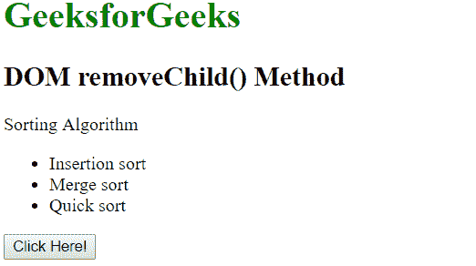
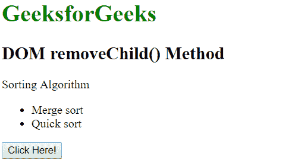

# HTML | DOM removeChild()方法

> 原文:[https://www.geeksforgeeks.org/html-dom-removechild-method/](https://www.geeksforgeeks.org/html-dom-removechild-method/)

HTML DOM 中的 **removeChild()** 方法用于移除给定元素的指定子节点。它将移除的节点作为节点对象返回，如果该节点不存在，则返回 null。
**语法:**

```html
node.removeChild( child )
```

**参数:**此方法接受单参数*子*，为必选项。它表示需要删除的节点。
**返回值:**返回一个节点对象，代表被删除的节点，如果节点不存在，则返回 null。
**例:**

## 超文本标记语言

```html
<!DOCTYPE html>
<html>
    <head>
        <title>
            HTML DOM removeChild() Method
        </title>
    </head>

    <body>

        <h1 style="color: green;">
            GeeksforGeeks
        </h1>

        <h2>
            DOM removeChild() Method
        </h2>

<p>Sorting Algorithm</p>

        <ul id = "listitem"><li>Insertion sort</li>
            <li>Merge sort</li>
            <li>Quick sort</li>
        </ul>

        <button onclick = "Geeks()">
            Click Here!
        </button>

        <script>
            function Geeks() {
                var doc = document.getElementById("listitem");
                doc.removeChild(doc.childNodes[0]);
            }
        </script>

    </body>
</html>                   
```

**输出:**
**之前点击按钮:**



**点击按钮后:**



**支持的浏览器:**以下列出 *DOM removeChild()方法*支持的浏览器:

*   谷歌 Chrome
*   微软公司出品的 web 浏览器
*   火狐浏览器
*   歌剧
*   旅行队