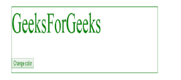
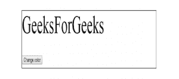

# HTML | DOM removeEventListener()方法

> 原文:[https://www . geesforgeks . org/html-DOM-removeeventlistener-method/](https://www.geeksforgeeks.org/html-dom-removeeventlistener-method/)

**removeEventListener()** 方法用于移除与 addEventListener()方法关联的事件处理程序。这种移除事件处理程序的方法只能与使用外部函数指定的 addEventListener()方法一起使用。

**语法:**

```html
element.removeEventListener(event, function, useCapture);

```

**参数**:该功能接受如下三个参数:

*   **事件**:参数*事件*指定要删除的事件名称。
*   **功能**:参数*功能*指定要删除的功能。
*   **使用捕获**:参数*使用捕获*表示要从事件处理程序中删除的事件阶段。如果 useCapture 的布尔值为 true，它将从捕获阶段移除事件处理程序，否则它将从冒泡阶段移除事件处理程序。

**示例:**在下面的示例中，调用事件处理程序，该程序在鼠标移动到分部上时更改分部标记的颜色。按下“更改颜色”按钮后，与分部标记相关联的事件处理程序将被移除，并且在鼠标移动到分部上时不会出现颜色变化。

```html
<!DOCTYPE html>
<html>
<head>
    <style>
        #myDIV {
            font-size:60px;
            border: 1px solid;
            padding: 50x;
            color: black;
        }
    </style>
</head>

<body>
    <div id="myDIV">
        GeeksForGeeks
    <br>

        <button onclick="removeHandler()" id="myBtn">
            Change color
        </button>
    </div>

    <script>
        document.getElementById("myDIV")
            .addEventListener("mousemove", myFunction);

        function myFunction() {
            document.getElementById("myDIV")
                        .style.color= "green";
        }

        function removeHandler() {
            document.getElementById("myDIV")
            .removeEventListener("mousemove", myFunction);
        }
    </script>
</body>
</html>                    
```

**输出:**
**按下按钮前:**

**按下按钮后:**


**支持的浏览器:**下面列出了 *removeEventListener()方法*支持的浏览器:

*   谷歌 Chrome 1.0
*   Internet Explorer 9.0
*   Firefox 1.0
*   Opera 7.0
*   Safari 1.0