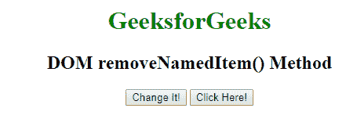
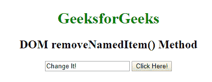

# HTML | DOM removeNamedItem()方法

> 原文:[https://www . geesforgeks . org/html-DOM-removenameditem-method/](https://www.geeksforgeeks.org/html-dom-removenameditem-method/)

HTML 中的 **removeNamedItem()** 方法用于移除 namednode 对象中具有指定名称的节点。
**语法:**

```html
namednode.removeNamedItem( nodename )
```

**参数:****移除名称项()**仅包含一个参数**节点名称**，如下所述。

*   **节点名:**该方法接受单参数*节点名*，该参数为必选项。它指的是 namednode 中需要删除的节点的名称。

**返回值:**它返回一个节点对象，代表被删除的属性节点

**例:**

## 超文本标记语言

```html
<!DOCTYPE html>
<html>
    <head>
        <title>
            DOM removeNamedItem() Method
        </title>
        <script>
            function myFunction() {
                var button =
                    document.getElementsByTagName("INPUT")[0];
                button.attributes.removeNamedItem("type");
            }
        </script>
    </head>

    <body style = "text-align: center;">

        <h1 style = "color: green">
            GeeksforGeeks
        </h1>

        <h2>
            DOM removeNamedItem() Method
        </h2>

        <input type="button" value="Change It!">

        <!-- removeNamedItem() method used here -->
        <button onclick="myFunction()">
            Click Here!
        </button>
    </body>
</html>                   
```

**输出:**
之前点击点击这里按钮:



点击点击此处按钮后:



**注意:**当我们移除输入元素的类型属性时，该元素将是类型*文本*，这是默认值。
**支持的浏览器:**下面列出了 *removeNamedItem()* 方法支持的浏览器:

*   谷歌 Chrome
*   微软公司出品的 web 浏览器
*   火狐浏览器
*   歌剧
*   旅行队