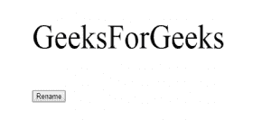

# HTML | DOM renameNode()方法

> 原文:[https://www.geeksforgeeks.org/html-dom-renamenode-method/](https://www.geeksforgeeks.org/html-dom-renamenode-method/)

在 HTML 文档中，使用 **document.renameNode()** 方法对节点进行重命名。重命名的节点必须是元素和属性类型。

**语法:**

```html
document.renameNode(node, namespaceURI, nodename)

```

**参数**:renameNode()将节点、名称空间 URI 和节点名作为参数传递。

*   **节点**:参数*节点*代表用户想要重命名的对象。
*   **namespaceURI** :参数 *namespaceURI* 表示节点的命名空间 URI。
*   **节点名**:该参数指定新的节点名。

**返回值**:该方法返回代表重命名节点的节点对象。

**示例**:下面的程序获取给定 HTML 脚本的第一段，并将其内容替换为“GeeksForGeeks”。然后它将第一段重新命名为< h1 >。

```html
<html>
<body>
    <p>hello</p>

    <button onclick="myFunction()">Rename</button>

    <script>
        function myFunction() {
            var p = document.getElementsByTagName("P")[0]
                .innerHTML="GeeksForGeeks";

            document.renameNode(p, null, "h1");
        }
    </script>
</body>
</html>                                  
```

**输出:**
**按下按钮前:**

**按下按钮后:**

**移植浏览器:**主要浏览器不支持 *DOM renameNode()方法*。