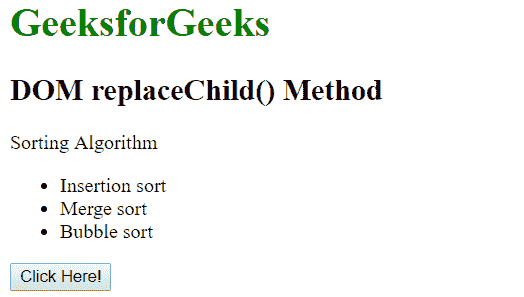
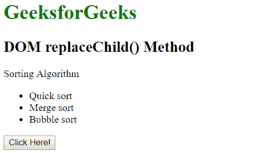

# HTML | DOM replaceChild()方法

> 原文:[https://www.geeksforgeeks.org/html-dom-replacechild-method/](https://www.geeksforgeeks.org/html-dom-replacechild-method/)

HTML DOM 中的 **replaceChild()** 方法用于在给定的父节点内用新节点替换子节点。

**语法:**

```html
parentNode.replaceChild( newChild, oldChild )
```

**参数值:**该方法接受下面列出的两个参数:

*   **newChild:** 为必选参数。它表示需要插入的新节点。
*   **oldChild:** 为必选参数。它表示被新节点替换的节点。

**返回值:**返回代表被替换节点的节点对象。

**示例:**在本示例中，第一个< li >文本被新文本替换。

```html
<!DOCTYPE html>
<html>
    <head>
        <title>DOM replaceChild() Method</title>
    </head>

    <body>

        <h1 style="color: green;">
            GeeksforGeeks
        </h1>

        <h2>
            DOM replaceChild() Method
        </h2>

        <p>Sorting Algorithm</p>
        <ul id = "listitem"><li>Insertion sort</li>
            <li>Merge sort</li>
            <li>Bubble sort</li>
        </ul>

        <button onclick ="Geeks()">
            Click Here!
        </button>

        <script>
        function Geeks() {
            var doc = document.createTextNode("Quick sort");
            var list = document.getElementById("listitem").childNodes[0];
            list.replaceChild(doc, list.childNodes[0]);
        }
        </script>

    </body>
</html>                    
```

**输出:**
**之前点击按钮:**

**之后点击按钮:**


**支持的浏览器:**以下列出了 *DOM replaceChild()方法*方法支持的浏览器:

*   谷歌 Chrome
*   微软公司出品的 web 浏览器
*   火狐浏览器
*   歌剧
*   旅行队