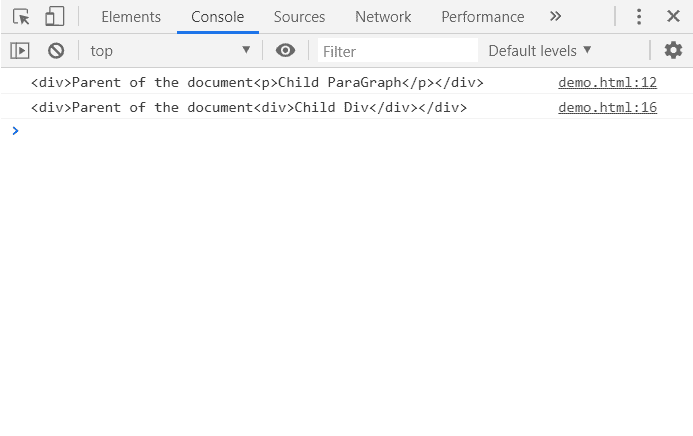

# HTML | DOM replaceWith()方法

> 原文:[https://www.geeksforgeeks.org/html-dom-replacewith-method/](https://www.geeksforgeeks.org/html-dom-replacewith-method/)

**replace with()**方法用一组 **Node 或 DOMString** 对象替换其父节点的子节点列表中的一个节点。多字符串对象相当于文本节点。这里**一个子元素**被**其他子元素代替。**

**语法:**

```html
ChildNode.replaceWith(Node);
```

**参数:**

*   **子节点:**要替换的子节点。
*   **节点:**子节点被替换的节点。

**返回值:** 无返回值。

**示例:**

在这个例子中，我使用这个方法将名为 **childPara ( < p >元素)**的 childNode 替换为名为 **childDiv ( < div >元素)**的节点。

## 超文本标记语言

```html
<!DOCTYPE html>
<html>

<head>
    <title>replaceWith() method</title>
    <script>
        var parent = document.createElement("div");
        parent.innerHTML = "Parent of the document";

        var childPara = document.createElement("p");
        childPara.innerHTML = "Child ParaGraph";
        parent.appendChild(childPara);
        console.log(parent.outerHTML);

        var childDiv = document.createElement("div");
        childDiv.innerHTML = "Child Div";
        childPara.replaceWith(childDiv);
        console.log(parent.outerHTML);
    </script>
</head>

<body>
    <h1>Welcome to GeeksforGeeks</h1>
</body>

</html>
```

**输出:**

在控制台中，可以看到:

*   在第 12 行，在应用 replaceWith()方法之前，父元素的外部 HTML 将 **< p >元素**作为子节点。
*   在第 16 行，应用此方法后，父元素将 **< div >元素**替换为子节点。

