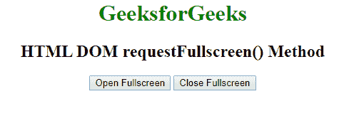

# HTML | DOM requestFullscreen()方法

> 原文:[https://www . geesforgeks . org/html-DOM-request full screen-method/](https://www.geeksforgeeks.org/html-dom-requestfullscreen-method/)

**requestFullscreen()方法**以全屏模式打开元素。如果元素处于全屏模式，那么什么都不会改变。与此方法相反的是 exitFullscreen()方法。

**语法:**

```html
HTMLElementObject.exitFullscreen()
```

**参数:**不接受任何参数。

**返回值:**不返回值。

**示例:**

```html
<!DOCTYPE html> 
<html> 

<head> 
    <title> 
        HTML DOM requestFullscreen() Method
    </title> 

    <script> 
        var elem = document.documentElement; 

        function closeFullS() { 
            if (document.exitFullscreen) 
                document.exitFullscreen(); 
        } 

        function openFullS() { 
            if (elem.requestFullscreen) 
                elem.requestFullscreen(); 
        } 
    </script> 
</head> 

<body style="text-align:center;"> 

    <h1 style="color:green">
        GeeksforGeeks
    </h1> 

    <h2>
        HTML DOM requestFullscreen() Method
    </h2>

    <button onclick="openFullS();"> 
        Open Fullscreen 
    </button> 

    <button onclick="closeFullS();"> 
        Close Fullscreen 
    </button> 
</body> 

</html>         
```

**输出:**


**支持的浏览器:**以下是 **requestFullscreen()方法**支持的浏览器:

*   铬
*   火狐浏览器
*   微软公司出品的 web 浏览器
*   歌剧
*   旅行队