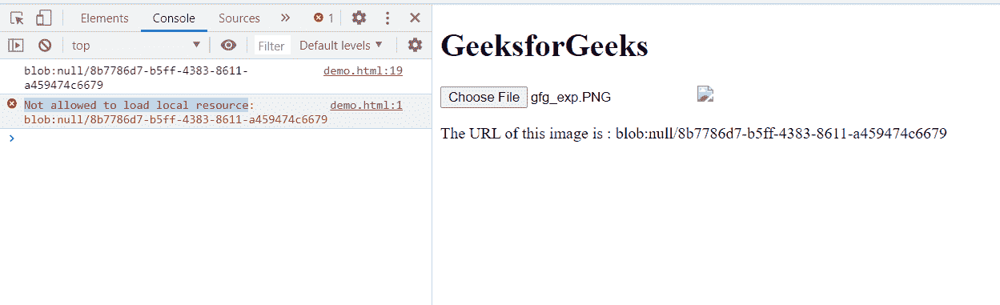
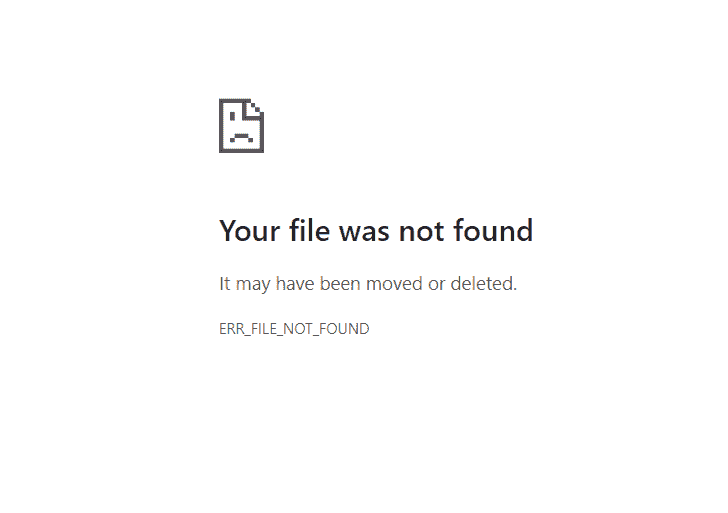

# HTML DOM revokeObjectURL()方法

> 原文:[https://www . geeksforgeeks . org/html-DOM-revokeobjecturl-method/](https://www.geeksforgeeks.org/html-dom-revokeobjecturl-method/)

**方法**释放一个现有的对象网址，该网址是通过使用网址创建对象网址()创建的。当您使用完一个对象 URL 并且不想让浏览器再保留对该文件的引用时，将调用此方法。

**语法:**

```html
URL.revokeObjectURL(objectURL);
```

**参数:**

*   **对象网址:**一个待发布的 DOMString 对象网址。

**返回值:**这个方法没有返回值。

**示例:**在本例中，使用 createObjectURL()方法创建一个 objectURL，然后将其撤销。

```html
<!DOCTYPE html>
<html>
<head>
  <meta charset="utf-8">
  <title>URL.revokeObjectURL example</title>
</head>
<body>
  <h1>GeeksforGeeks</h1>
  <input type="file">
  
  <p class="p">The URL of this image is : </p>
</body>
<script>
    var Element = document.querySelector('input');
    var img = document.querySelector('img');
    Element.addEventListener('change', function() {
      var url = URL.createObjectURL(Element.files[0]);
      img.src = url;
      console.log(url);
      URL.revokeObjectURL(url)
      var d=document.querySelector(".p");
      d.textContent+=url;
});
</script>
</html>
```

**输出:**

**选择图像前:**


**选择图像后:**在控制台中可以看到一个错误，由于网址被撤销，所以“不允许加载本地资源”。



**检查对象网址也会给出“找不到文件”:**



**支持的浏览器:**

*   谷歌 Chrome
*   边缘
*   火狐浏览器
*   旅行队
*   歌剧
*   微软公司出品的 web 浏览器