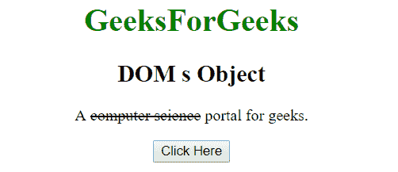

# HTML | DOM S 对象

> 原文:[https://www.geeksforgeeks.org/html-dom-s-object/](https://www.geeksforgeeks.org/html-dom-s-object/)

HTML DOM 中的 S 对象用来表示 HTML s 元素。此标签用于指定文本内容不再正确或准确。使用 getElementById()方法可以访问~~元素。~~

**语法:**

```html
document.getElementById("id"); 
```

其中 id 被分配给~~标签。
**例 1:**~~

## 超文本标记语言

```html
<!DOCTYPE html>
<html>
    <head>
        <title>
            HTML DOM S Object
        </title>
    </head>

    <body style = "text-align:center;">

        <h1 style = "color:green;" >
            GeeksForGeeks
        </h1>

        <h2>DOM s Object</h2>

<p>
            A <s id = "s">computer science</s>
            portal for geeks.
        </p>

        <button onclick = "Geeks()">
            Click Here
        </button>

        <script>
            function Geeks() {
                var txt = document.getElementById("s");
                txt.style.color = "green";
            }
        </script>
    </body>
</html>                   
```

**输出:**
**之前点击按钮:**



**点击按钮后:**


**例 2:** 可以使用 document.createElement 方法创建 S 对象。

## 超文本标记语言

```html
<!DOCTYPE html>
<html>
    <head>
        <title>
            HTML DOM S Object
        </title>
    </head>

    <body style = "text-align:center;">

        <h1 style = "color:green;" >
            GeeksForGeeks
        </h1>

        <h2>DOM S Object</h2>

        <button onclick = "Geeks()">
            Click Here!
        </button>

        <br><br>

        <div>
            A <span id = "p"></span> portal for geeks.
        </div>

        <script>
            function Geeks() {
                var txt = document.createElement("S");
                var t = document.createTextNode("computer science");
                txt.appendChild(t);
                document.getElementById("p").appendChild(txt);
            }
        </script>
    </body>
</html>                   
```

**输出:**
**之前点击按钮:**


**点击按钮后:**


**支持的浏览器:**

*   谷歌 Chrome
*   Mozilla Firefox
*   边缘
*   旅行队
*   歌剧