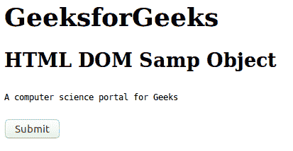
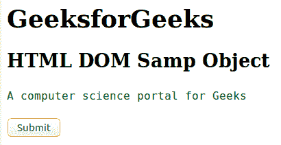
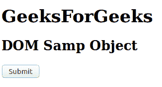
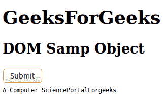

# HTML | DOM Samp 对象

> 原文:[https://www.geeksforgeeks.org/html-dom-samp-object/](https://www.geeksforgeeks.org/html-dom-samp-object/)

HTML DOM 中的 Samp 对象用来表示<samp>元素。使用 getElementById()方法可以访问<samp>元素。</samp></samp>

**语法:**

```html
document.getElementById("ID");
```

其中标识被分配给<samp>标签。</samp>

**例 1:**

```html
<!DOCTYPE html> 
<html> 
    <head> 
        <title>
            HTML DOM samp Object
        </title> 
    </head> 

    <body> 
        <h1>
            GeeksforGeeks
        </h1>

        <h2>
            HTML DOM Samp Object
        </h2>

        <samp id = "geeks">
            A computer science portal for Geeks
        </samp>

        <br><br>

        <button onclick = "myGeeks()">
            Submit
        </button>

        <script>
            function myGeeks() {
                var txt = document.getElementById("geeks");
                txt.style.color = "green";
                txt.style.fontSize = "16px";
            }
        </script>
    </body> 
</html>                              
```

**输出:**
**点击按钮前:**

**点击按钮后:**


**示例 2:** 可以使用*文档.创建元素*方法创建采样对象。

```html
<!DOCTYPE html> 
<html> 
    <head> 
        <title>
            HTML DOM samp Object
        </title> 
    </head> 

    <body> 
        <h1>GeeksForGeeks</h1>

        <h2>DOM Samp Object</h2>

        <button onclick = "myGeeks()">
            Submit
        </button><br>

        <script>
            function myGeeks() {
                var cont = document.createElement("SAMP");
                var txt = document.createTextNode(
                           "A Computer SciencePortalForgeeks");

                cont.appendChild(txt);
                document.body.appendChild(cont);
            }
        </script>
    </body> 
</html>                             
```

**输出:**
**点击按钮前:**

**点击按钮后:**


**支持的浏览器:***DOM Samp 对象*支持的浏览器如下:

*   谷歌 Chrome
*   微软公司出品的 web 浏览器
*   火狐浏览器
*   歌剧
*   旅行队