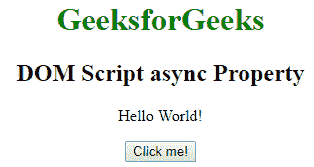
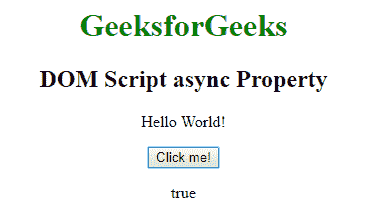

# HTML | DOM 脚本异步属性

> 原文:[https://www . geesforgeks . org/html-DOM-script-async-property/](https://www.geeksforgeeks.org/html-dom-script-async-property/)

**DOM 脚本异步属性**用于设置或返回脚本是否应该异步执行。此属性用于反映异步属性。此属性仅适用于外部脚本。

可以通过以下方式执行外部脚本:

*   当 async 存在时，脚本将与页面的其余部分异步执行。意味着当页面继续解析时，脚本将被执行。
*   如果延迟存在但异步不存在，那么当页面完成解析时，脚本将被执行。
*   如果两者都不存在，异步或延迟，那么脚本将被提取并立即执行，甚至在浏览器继续解析页面之前。

**语法:**

*   它返回异步属性。

    ```html
    scriptObject.async
    ```

*   它用于设置异步属性。

    ```html
    scriptObject.async = true|false
    ```

**属性值:**它包含一个布尔值，该值指定脚本是否应该在可用时立即异步执行。

*   **True:** 指定脚本应该异步执行。
*   **false:** It specifies that the script will not be executed asynchronously.

    **返回值:**返回一个布尔值，指定脚本是否异步执行。

    **示例:**

    ```html
    <!DOCTYPE html>
    <html>

    <head>
        <title>
            HTML DOM Script async Property
        </title>
    </head>

    <body style="text-align:center;">

        <h1 style="color:green;">
            GeeksforGeeks
        </h1>

        <h2>DOM Script async Property </h2>

        <p id="p1">Hello World!</p>

        <script id="myScript" src="demo_async.js" async></script>

        <!-- Button that trigger the Function -->
        <button onclick="myFunction()">Click me!</button>

        <p id="demo"></p>

        <!-- Main Function -->
        <script>
            function myFunction() {
                var x = document.getElementById("myScript").async;
                document.getElementById("demo").innerHTML = x;
            }
        </script>
    </body>

    </html>                    
    ```

    **输出:**

    *   **点击按钮前:**
        
    *   **点击按钮后:**
        

    **支持的浏览器:**HTML DOM Script 异步属性支持的浏览器如下:

    *   谷歌 Chrome
    *   Internet Explorer 10.0
    *   火狐浏览器
    *   旅行队
    *   歌剧