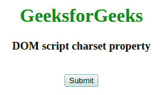
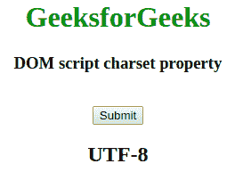
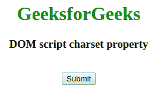
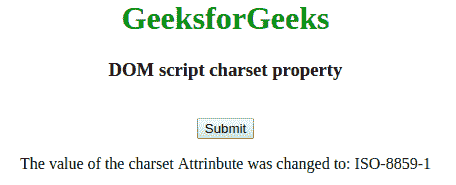

# HTML | DOM 脚本字符集属性

> 原文:[https://www . geesforgeks . org/html-DOM-script-charset-property/](https://www.geeksforgeeks.org/html-dom-script-charset-property/)

**HTML DOM Script 字符集属性**用于设置或返回<脚本>元素的字符集属性的值。charset 属性用于指定外部脚本中使用的字符编码。
**语法:**

*   它返回 charset 属性。

```html
scriptObject.charset
```

*   它用于设置字符集属性。

```html
scriptObject.charset = charset 
```

**属性值:**它包含单个值**字符集**，用于指定外部脚本中使用的字符编码。

*   **“ISO-8859-1”:**用于指定拉丁字母的标准编码。
*   **“UTF-8”:**用于指定 Unicode 的字符编码。兼容 ASCII。

**返回值:**返回一个字符串值，代表脚本元素的字符编码。
**示例:**这个示例说明了如何返回脚本字符集属性。

## 超文本标记语言

```html
<!DOCTYPE html>
<html>

<head>
    <title>
        DOM script charset Property
    </title>
</head>

<body>
    <center>
        <h1 style="color:green;">
            GeeksforGeeks
        </h1>

        <h3>
            DOM script charset property
        </h3>

        <script id="myGeeks" type="text/javascript"
                src="my_script.js" charset="UTF-8">
        </script>
        <br>

        <button onclick="Geeks()">Submit</button>

        <h2 id="demo"></h2>

        <script>
            function Geeks() {
                var x = document.getElementById("myGeeks").charset;

                document.getElementById("demo").innerHTML = x;
            }
        </script>
    </center>
</body>

</html>                         
```

**输出:**

*   **点击按钮前:**



*   **点击按钮后:**



**示例 2:** 本示例说明如何设置脚本字符集属性。

## 超文本标记语言

```html
<!DOCTYPE html>
<html>

<head>
    <title>
        DOM script charset Property
    </title>
</head>

<body>
    <center>
        <h1 style="color:green;">
            GeeksforGeeks
        </h1>

        <h3>
            DOM script charset property
        </h3>

        <script id="myGeeks" type="text/javascript"
                src="my_script.js" charset="UTF-8">
        </script>
        <br>

        <button onclick="Geeks()">Submit</button>

        <p id="demo"></p>

        <script>
            function Geeks() {
                var x = document.getElementById("myGeeks").charset
                            = "ISO-8859-1";

                document.getElementById("demo").innerHTML
                            = "The value of the charset Attrinbute"
                            + " was changed to: " + x;
            }
        </script>
    </center>
</body>

</html>              
```

**输出:**

*   **点击按钮前:**



*   **点击按钮后:**



**支持的浏览器:**HTML DOM Script 字符集属性支持的浏览器如下:

*   谷歌 Chrome
*   微软公司出品的 web 浏览器
*   火狐浏览器
*   旅行队
*   歌剧