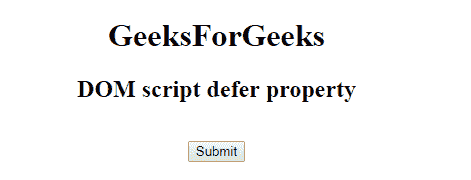
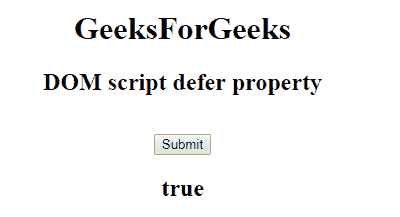

# HTML | DOM 脚本延期属性

> 原文:[https://www . geesforgeks . org/html-DOM-script-delay-property/](https://www.geeksforgeeks.org/html-dom-script-defer-property/)

**脚本延迟属性**用于设置或返回页面解析完成后是否执行脚本。该属性用于反映<脚本>标签的延迟属性。
此属性仅用于外部 JavaScript 文件。

**语法:**

*   它返回延迟属性。

    ```html
    scriptObject.defer
    ```

*   用于设置延迟属性

    ```html
    scriptObject.defer = true|false
    ```

**属性值:**它包含布尔值，该值指定当页面完成解析时是否应该执行脚本

*   **true:** 当页面完成解析时，脚本被执行
*   **false:** 页面解析完成后，脚本不会执行。

**返回值:**返回布尔值，如果在页面加载完成后执行脚本，则返回 true。

**示例:**本示例返回延迟属性。

```html
<!DOCTYPE html> 
<html> 

<head> 
    <title> 
        DOM script defer Property 
    </title> 
</head> 

<body style="text-align:center;"> 
    <h1> 
        GeeksForGeeks 
    </h1> 

    <h2> 
        DOM script defer property
    </h2> 

    <script id="myGeeks" type="text/javascript" 
            src="my_script.js" defer>
    </script><br>
    <button onclick="Geeks()">Submit</button>
    <h2 id="demo"></h2>
     <script>
                 function Geeks()  {
          var x = document.getElementById("myGeeks").defer;
  document.getElementById("demo").innerHTML =  x;
}

     </script>

</body> 

</html>
```

**输出:**

**点击按钮前:**

**点击按钮后:**
