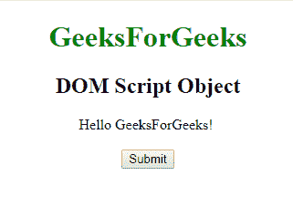
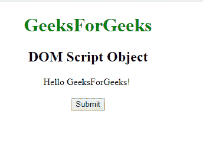
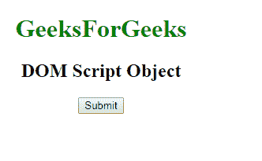
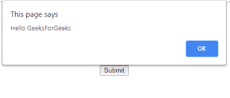

# HTML | DOM 脚本对象

> 原文:[https://www.geeksforgeeks.org/html-dom-script-object/](https://www.geeksforgeeks.org/html-dom-script-object/)

**DOM 脚本对象**用于表示 HTML [<脚本>](https://www.geeksforgeeks.org/html-script-tag/) 元素。*脚本元素*由 **getElementById()** 访问。

**属性:**

*   **异步:**用于指定脚本异步执行。
*   **字符集:**用于指定外部脚本文件中使用的字符编码。
*   **delay:**用于指定页面解析完毕后执行脚本。
*   **src:** 用于指定外部脚本文件的 URL。
*   **类型:**用于指定脚本的媒体类型。

**语法:**

```html
document.getElementById("ID");
```

其中**“id”**是分配给**“剧本”**标签的 ID。

**示例-1:**

```html
<!DOCTYPE html>
<html>

<head>
    <style>
        body {
            text-align: center;
        }

        h1 {
            color: green;
        }
    </style>
</head>

<body>
    <h1>GeeksForGeeks</h1>
    <h2>DOM Script Object </h2>

    <!-- Assigning id to script. -->
    <script id="GFG">
        Hello GeeksForGeeks!
    </script>
    <br>
    <br>

    <button onclick="myGeeks()">Submit</button>

    <p id="sudo"></p>

    <script>
        function myGeeks() {

            //  Accessing script object
            var g = document.getElementById(
              "GFG").text;
            document.getElementById(
              "sudo").innerHTML = g;
        }
    </script>
</body>

</html>
```

**输出:**

**点击按钮前:**


**点击按钮后:**


**示例-2:** 脚本对象可以使用**文档. createElement 方法创建。**

```html
<!DOCTYPE html>
<html>

<head>
    <style>
        body {
            text-align: center;
        }

        h1 {
            color: green;
        }
    </style>
</head>

<body>
    <h1>GeeksForGeeks</h1>
    <h2>DOM Script Object </h2>

    <button onclick="myGeeks()">
      Submit
  </button>

    <script>
        function myGeeks() {

            //  Creating 'script' object.
            var g = 
            document.createElement("SCRIPT");

            var f =
            document.createTextNode("alert(
                 'Hello GeeksForGeeks')");

            g.appendChild(f);
            document.body.appendChild(g);
        }
    </script>

</body>

</html>
```

**输出:**

**点击按钮前:**


**点击按钮后:**


**支持的浏览器:****DOM 脚本对象**支持的浏览器如下:

*   谷歌 Chrome
*   微软公司出品的 web 浏览器
*   火狐浏览器
*   旅行队
*   歌剧