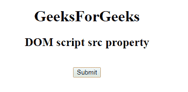

# HTML | DOM 脚本 src 属性

> 原文:[https://www.geeksforgeeks.org/html-dom-script-src-property/](https://www.geeksforgeeks.org/html-dom-script-src-property/)

**DOM 脚本 src 属性**用于**设置**或**返回** *一个 [<脚本>](https://www.geeksforgeeks.org/html-script-tag/) 元素*的 src 属性的值。src 属性指定外部 Javascript 文件的网址。

**语法:**

*   它返回 src 属性:

    ```html
    scriptObject.src
    ```

*   用于设置 src 属性:

    ```html
    scriptObject.src = URL
    ```

**属性值:**包含指定外部 Javascript 文件网址的值，即**网址**。

**两种网址:**

*   **绝对网址:**指向另一个网站。
*   **A relative URL:** it points to a file within the websites.

    **返回值:**返回一个字符串值，代表外部 Javascript 文件的网址。

    **示例:**本示例返回 src 属性。

    ```html
    <!DOCTYPE html>
    <html>

    <head>
        <title>
            DOM script src Property
        </title>
    </head>

    <body style="text-align:center;">
        <h1> 
            GeeksForGeeks 
        </h1>

        <h2> 
            DOM script src property
        </h2>

        <script id="myGeeks"
                type="text/javascript" 
                src="my_script.js">
        </script>
        <br>
        <button onclick="Geeks()">Submit</button>
        <h2 id="demo"></h2>
        <script>
            function Geeks() {
                var x = document.getElementById(
                  "myGeeks").src;
                document.getElementById(
                  "demo").innerHTML = x;
            }
        </script>

    </body>

    </html>
    ```

    **输出:**

    **点击按钮前:**
    

    **点击按钮后:**
    

    **支持的浏览器:**下面列出了**HTML | DOM Script src Property**支持的浏览器:

    *   谷歌 Chrome
    *   微软公司出品的 web 浏览器
    *   火狐浏览器
    *   苹果 Safari
    *   歌剧