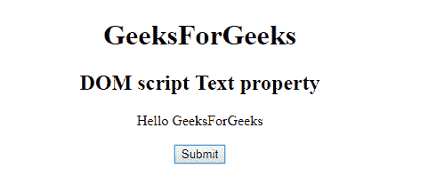
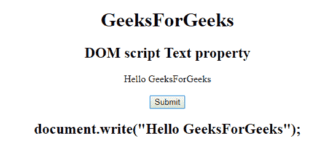
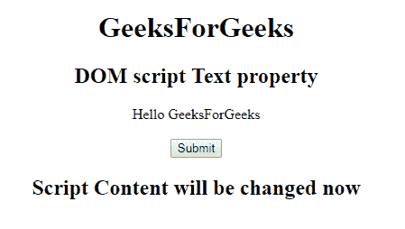

# HTML | DOM 脚本文本属性

> 原文:[https://www . geesforgeks . org/html-DOM-script-text-property/](https://www.geeksforgeeks.org/html-dom-script-text-property/)

**HTML| DOM 脚本文本属性**用于**设置**或**返回** *脚本<>元素*的内容。

**语法:**

*   它返回文本属性:

    ```html
    scriptObject.text
    ```

*   用于设置文本属性:

    ```html
    scriptObject.text = contents 
    ```

**属性值:**包含值，即**内容**，指定<脚本>元素的内容。

**返回值:**返回一个代表脚本元素内容的字符串值。即脚本的所有文本节点，但忽略注释。

**示例:**本示例用于返回文本属性。

```html
<!DOCTYPE html>
<html>

<head>
    <title>
        DOM script text Property
    </title>
</head>

<body style="text-align:center;">
    <h1> 
        GeeksForGeeks 
    </h1>

    <h2> 
        DOM script Text property
    </h2>

    <script id="myGeeks" 
            type="text/javascript">
        document.write("Hello GeeksForGeeks");
    </script>
    <br>
    <br>
    <button onclick="Geeks()">Submit</button>
    <h2 id="demo"></h2>
    <script>
        function Geeks() {
            var x = 
                document.getElementById("myGeeks").text;
            document.getElementById("demo").innerHTML =
              x;
        }
    </script>

</body>

</html>
```

**输出:**
**点击按钮前:**

。
**点击按钮后:**


**示例-2:** 本示例用于设置文本属性。

```html
<!DOCTYPE html>
<html>

<head>
    <title>
        DOM script text Property
    </title>
</head>

<body style="text-align:center;">
    <h1> 
        GeeksForGeeks 
    </h1>

    <h2> 
        DOM script Text property
    </h2>

    <script id="myGeeks" type="text/javascript">
        document.write("Hello GeeksForGeeks");
    </script>
    <br>
    <br>
    <button onclick="Geeks()">Submit</button>
    <h2 id="demo"></h2>
    <script>
        function Geeks() {
            var x = document.getElementById(
              "myGeeks").text = "Script Content will be changed now";
            document.getElementById("demo").innerHTML = x;
        }
    </script>

</body>

</html>
```

**输出:**
**点击按钮前:**


**点击按钮后:**


**支持的浏览器:****HTML | DOM 脚本文本属性**支持的浏览器如下:

*   谷歌 Chrome
*   微软公司出品的 web 浏览器
*   火狐浏览器
*   苹果 Safari
*   歌剧