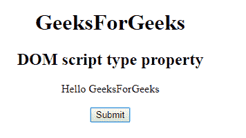
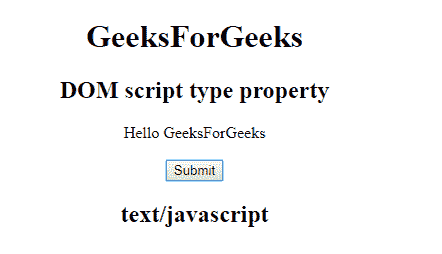
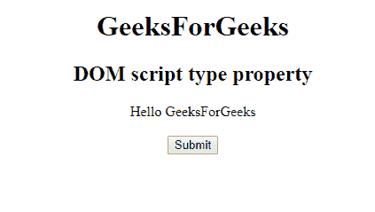
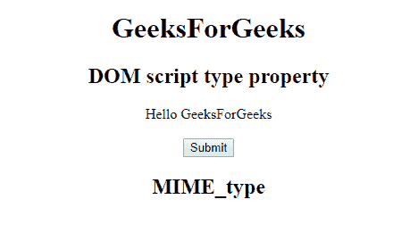

# HTML | DOM 脚本类型属性

> 原文:[https://www . geesforgeks . org/html-DOM-script-type-property/](https://www.geeksforgeeks.org/html-dom-script-type-property/)

**DOM 脚本类型属性**用于**设置**或**返回** *一个<脚本>元素*的类型属性的值。类型属性用于指定脚本的 MIME 类型。并识别<脚本>标签的内容。它的默认值是*“文本/JavaScript”*。

**语法:**

*   用于返回类型属性:

    ```html
    scriptObject.type 
    ```

*   用于设置类型属性:

    ```html
    scriptObject.type = MIME_type 
    ```

**属性值:**它包含指定脚本的 MIME 类型的值，即 **MIME 类型**。

**共同值:**

*   文本/javascript(这是默认设置)
*   文本/ecmascript
*   应用程序/ecmascript
*   应用程序/javascript

**返回值:**返回一个字符串值，代表脚本的 MIME 类型。

**示例 1:** 本示例说明如何返回类型属性。

```html
<!DOCTYPE html>
<html>

<head>
    <title>
        DOM script type Property
    </title>
</head>

<body style="text-align:center;">
    <h1> 
        GeeksForGeeks 
    </h1>

    <h2> 
        DOM script type property
    </h2>

    <script id="myGeeks" type="text/javascript">
        document.write("Hello GeeksForGeeks");
    </script>
    <br>
    <br>
    <button onclick="Geeks()">Submit</button>
    <h2 id="demo"></h2>
    <script>
        function Geeks() {
            var x = document.getElementById("myGeeks").type;
            document.getElementById("demo").innerHTML = x;
        }
    </script>

</body>

</html>
```

**输出:**
**点击按钮前:**


**点击按钮后:**


**示例 2:** 本示例说明如何设置类型属性。

```html
<!DOCTYPE html>
<html>

<head>
    <title>
        DOM script type Property
    </title>
</head>

<body style="text-align:center;">
    <h1> 
        GeeksForGeeks 
    </h1>

    <h2> 
        DOM script type property
    </h2>

    <script id="myGeeks" type="text/javascript">
        document.write("Hello GeeksForGeeks");
    </script>
    <br>
    <br>
    <button onclick="Geeks()">Submit</button>
    <h2 id="demo"></h2>
    <script>
        function Geeks() {
            var x = 
                document.getElementById("myGeeks").type = 
                "MIME_type ";
            document.getElementById("demo").innerHTML = x;
        }
    </script>

</body>

</html>
```

**输出:**
**点击按钮前:**


**点击按钮后:**


**支持的浏览器:****DOM 脚本类型属性**支持的浏览器如下:

*   谷歌 Chrome
*   微软公司出品的 web 浏览器
*   火狐浏览器
*   苹果 Safari
*   歌剧