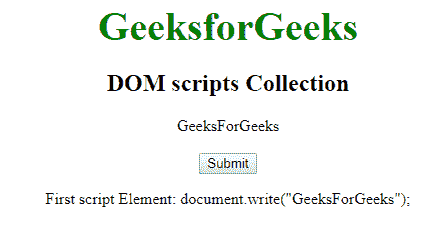

# HTML | DOM 脚本集合

> 原文:[https://www.geeksforgeeks.org/html-dom-scripts-collection/](https://www.geeksforgeeks.org/html-dom-scripts-collection/)

HTML 中的 **DOM 脚本集合**用于返回 HTML 文档中所有<脚本>元素的集合。脚本元素按照源代码中的显示进行排序。

**语法:**

```html
document.scripts
```

**属性值:**返回单值长度，即所有脚本元素的集合。

**方法:**

*   **【索引】:**用于返回所选索引的<脚本>元素。索引值以 0 开始。如果索引值超出范围，则返回空值。
*   **项(索引):**用于返回所选索引的<脚本>元素。索引值以 0 开始。如果索引值超出范围，则返回空值。
*   **name item(id):**用于返回集合中给定 id 属性的<脚本>元素。如果 id 无效，它将返回 NULL。

**例 1:**

```html
<!DOCTYPE html> 
<html> 
    <head> 
        <title>DOM scripts collection</title> 

        <style> 
            .gfg { 
                font-size:40px; 
                font-weight:bold; 
                color:green; 
            } 
            body { 
                text-align:center; 
                font-family:Times; 
            } 
        </style> 
    </head> 

    <body> 
        <a name="" class="gfg">GeeksforGeeks</a> 

        <h2>DOM scripts Collection</h2>

        <!-- script content -->
        <script>
            document.write("GeeksForGeeks");
        </script><br><br>

        <button onclick="Geeks()">Submit</button>

        <p id="sudo"></p> 

        <!-- script content -->
        <script> 
            function Geeks() { 
                var x = document.scripts.length; 
                document.getElementById("sudo").innerHTML = 
                "Number of scripts elements: " + x; 
            } 
        </script> 

    </body> 
</html>                                 
```

**输出:**
**点击按钮前:**

**点击按钮后:**


**例 2:**

```html
<!DOCTYPE html> 
<html> 
    <head> 
        <title>DOM scripts collection</title> 

        <style> 
            .gfg { 
                font-size:40px; 
                font-weight:bold; 
                color:green; 
            } 
            body { 
                text-align:center; 
                font-family:Times; 
            } 
        </style> 
    </head> 

    <body> 
        <a name="" class="gfg">GeeksforGeeks</a> 

        <h2>DOM scripts Collection</h2>

        <!-- script content -->
        <script>
            document.write("GeeksForGeeks");
        </script><br><br>

        <button onclick = "Geeks()">Submit</button> 

        <p id="sudo"></p> 

        <!-- script content -->
        <script> 
            function Geeks() { 
                var x = document.scripts[0].text;; 
                document.getElementById("sudo").innerHTML = 
                "First script Element: " + x;
            } 
        </script> 

    </body> 
</html>                                         
```

**输出:**
**点击按钮前:**

**点击按钮后:**


**支持的浏览器:***DOM 脚本集合*支持的浏览器如下:

*   谷歌 Chrome
*   微软公司出品的 web 浏览器
*   Firefox 9.0
*   歌剧
*   旅行队