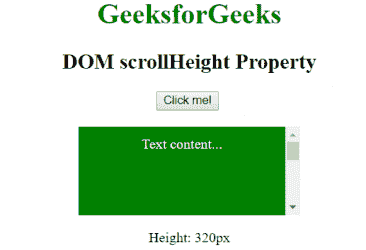

# HTML | DOM scrollHeight 属性

> 原文:[https://www . geesforgeks . org/html-DOM-scroll height-property/](https://www.geeksforgeeks.org/html-dom-scrollheight-property/)

**DOM scrollHeight 属性**用于返回元素的高度。此属性包括填充以及由于溢出而在屏幕上不可见的内容，但不包括边框、滚动条或边距。它是只读属性。

**语法:**

```html
element.scrollHeight
```

**返回值:**以像素为单位返回元素内容的高度。

**示例:**

```html
<!DOCTYPE html>
<html>
    <head>
        <title>
            HTML DOM scrollHeight Property
        </title>

        <style>
            #GFG {
                width: 250px;
                height: 100px;
                overflow: auto;
                margin: auto;
            }

            #content {
                height: 300px;
                padding: 10px;
                background-color: green;
                color: white;
            }
        </style>

        <!-- script to find the scroll height -->
        <script>
            function Geeks() {
                var doc = document.getElementById("content");
                var x = doc.scrollHeight;
                document.getElementById ("p").innerHTML
                        = "Height: " + x + "px";
            }
        </script>
    </head>

    <body style = "text-align: center;">

        <h1 style = "color:green;">
            GeeksforGeeks
        </h1>

        <h2>
            DOM scrollHeight Property
        </h2>

        <button onclick="Geeks()">
            Click me!
        </button>
        <br><br>

        <div id = "GFG">
            <div id = "content">
                Text content...
            </div>
        </div>

        <p id = "p"></p>
    </body>
</html>                    
```

**输出:**
**点击按钮前:**

**点击按钮后:**

**支持的浏览器:**支持的浏览器由 *scrollHeight 属性*列出如下:

*   谷歌 Chrome 4.0
*   Internet Explorer 8.0
*   Firefox 3.0
*   歌剧
*   Safari 4.0