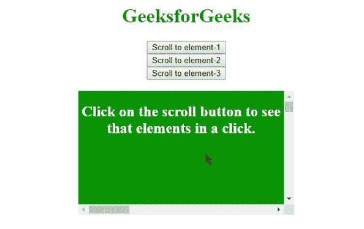
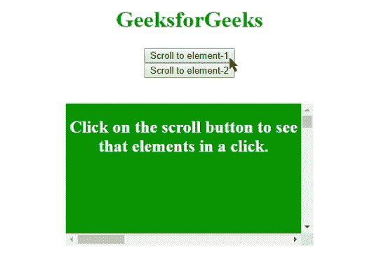

# HTML | DOM scrollIntoView()方法

> 原文:[https://www . geesforgeks . org/html-DOM-scrollintoview-method/](https://www.geeksforgeeks.org/html-dom-scrollintoview-method/)

scrollIntoView()方法将指定的元素滚动到浏览器窗口的可见区域。

**语法:**

```html
document.getElementById("id").scrollIntoView(alignTo);
```

**参数:**

*   **alignTo:** It is a Boolean type parameter containing true or false value. The default value is set to true.
    *   **true:** 将元素滚动到其窗口顶部。
    *   **false:** 将元素滚动到其窗口底部。

    请注意，基本术语不是“顶部”或“底部”，我将在下一节中讨论。
    所以，这就像用一个分配了窗口或元素特定坐标的按钮在各自窗口的元素间悬停一样。

**示例:**

```html
<!DOCTYPE html>
<html>

<head>
    <style>
        #element {
            height: 200px;
            width: 350px;
            overflow: auto;
            background: green;
        }

        #content1 {
            margin: 500px;
            height: 100px;
            width: 1000px;
            background-color: white;
        }

        #content2 {
            margin: 500px;
            height: 50px;
            width: 1000px;
            background-color: grey;
        }

        #content3 {
            margin: 500px;
            height: 150px;
            width: 1000px;
            background-color: coral;
        }
    </style>
    <script>
        function myFunction1() {
            var e = document.getElementById("content1");
            e.scrollIntoView(false); // Makes the element 
        }

        function myFunction2() {
            var e = document.getElementById("content2");
            e.scrollIntoView(true);
        }

        function myFunction3() {
            var e = document.getElementById("content3");
            e.scrollIntoView(); // Default is true
        }
    </script>
</head>

<body>
    <center>
        <h1 style="color: green">GeeksforGeeks</h1>
        <button onclick="myFunction1()">Scroll to element-1</button>
        <br>
        <button onclick="myFunction2()">Scroll to element-2</button>
        <br>
        <button onclick="myFunction3()">Scroll to element-3</button>
        <br>
        <br>

        <div id="element">
            <h2 style="color: white">
              Click on the scroll button to see
              that elements in a click.</h2>
            <div id="content1">
                <h2 align="left">Element-1</h2>
            </div>
            <div id="content2">
                <h2 align="left">Element-2</h2>
            </div>
            <div id="content3">
                <h2 align="left">Element-3</h2>
            </div>
        </div>
    </center>
</body>

</html>
```

**输出:**


所以，在上面的例子中，项目之间的转换并不顺利，只是元素之间的跳跃。
为了让它看起来很酷，**对象参数**在这个用途上派上了用场。

**语法:**

```html
document.getElementById("id").scrollIntoView({
  behavior: smooth | auto;
  block: start | center | end | nearest;
  inline: start | center | end | nearest;
});

```

决定滚动平滑度的**行为**对象有“平滑”和“自动”两种模式。
**块**对象确定元素视图应该从块的哪个部分开始。
内联**对象确定视图应该从元素的哪个对齐位置开始。**

****示例:****

```html
<!DOCTYPE html>
<html>

<head>
    <style>
        #element {
            height: 200px;
            width: 350px;
            overflow: auto;
            background: green;
        }

        #content1 {
            margin: 500px;
            height: 100px;
            width: 1000px;
            background-color: white;
        }

        #content2 {
            margin: 500px;
            height: 50px;
            width: 1000px;
            background-color: grey;
        }
    </style>
    <script>
        function myFunction1() {
            var e = document.getElementById("content1");
            e.scrollIntoView({
                block: 'start',
                behavior: 'smooth',
                inline: 'start'
            });
        }

        function myFunction2() {
            var e = document.getElementById("content2");

            // Ends the block to the window 
            // Bottom and aligns the view to the center 
            e.scrollIntoView({
                block: 'end',
                behavior: 'smooth',
                inline: 'center'
            });
        }
    </script>
</head>

<body>
    <center>
        <h1 style="color: green">GeeksforGeeks</h1>
        <button onclick="myFunction1()">
          Scroll to element-1
      </button>
        <br>
        <button onclick="myFunction2()">
          Scroll to element-2
      </button>
        <br>
        <br>
        <br>

        <div id="element">
            <h2 style="color: white">
              Click on the scroll button to 
              see that elements in a click.
          </h2>
            <div id="content1">
                <h2 align="left">Element-1 aligned to start</h2>
            </div>
            <div id="content2">
                <h2>Element-2 aligned to center</h2>
            </div>
        </div>
    </center>
</body>

</html>
```

****输出:**
**