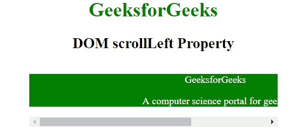
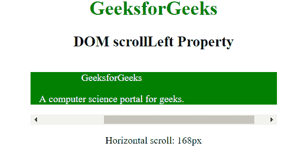
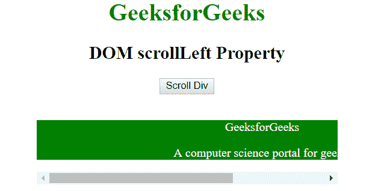
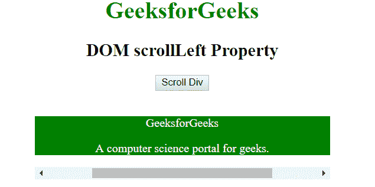

# HTML | DOM 滚动属性

> 原文:[https://www.geeksforgeeks.org/html-dom-scrollleft-property/](https://www.geeksforgeeks.org/html-dom-scrollleft-property/)

DOM **滚动**属性用于返回或设置元素的像素数，即水平滚动。如果元素的内容没有生成滚动条，那么它的 scrollLeft 值为 0；

**语法:**

*   它返回 scrollLeft 属性。

    ```html
    element.scrollLeft
    ```

*   它用于设置 scrollLeft 属性。

    ```html
    element.scrollLeft = value
    ```

其中**值**指定元素内容水平滚动的像素数。
T3【注:

*   它的价值不能是负数。
*   如果指定的值大于最大滚动量，则该值被设置为最大值。

**示例-1:**

```html
<html>

<head>
    <title>HTML DOM scrollLeft Property</title>
    <style>
        #div {
            width: 400px;
            overflow: auto;
            margin: auto;
        }

        #ele {
            width: 600px;
            background-color: green;
            color: white;
        }
    </style>
</head>

<body style="text-align: center;">
    <h1 style="color:green;">
            GeeksforGeeks
        </h1>

    <h2>
            DOM scrollLeft Property
        </h2>

    <div id="div" onscroll="Geeks()">
        <div id="ele">
            <p>GeeksforGeeks</p>
            <p>A computer science portal for geeks.</p>
        </div>
    </div>

    <p id="p"></p>

    <script>
        function Geeks() {
            var doc = document.getElementById("div");
            var x = doc.scrollLeft;
            document.getElementById("p").innerHTML =
                "Horizontal scroll: " + x + "px";
        }
    </script>
</body>

</html>
```

**输出:**
**滚动前:**


**滚动后:**


**示例-2:**

```html
<html>

<head>
    <title>HTML DOM scrollLeft Property</title>
    <style>
        #div {
            height: 100px;
            width: 250px;
            overflow: auto;
            margin: auto;
        }

        #ele {
            height: 300px;
            Width: 400;
            background-color: green;
            color: white;
        }
    </style>
</head>

<body style="text-align: center;">
    <h1 style="color:green;">
            GeeksforGeeks
        </h1>

    <h2>
            DOM scrollLeft Property
        </h2>

    <button onclick="Geeks()">Scroll Div</button>
    <br>
    <br>

    <div id="div" onscroll="Geeks()">
        <div id="ele">
            <p>GeeksforGeeks</p>
            <p>A computer science portal for geeks.</p>
        </div>
    </div>

    <script>
        function Geeks() {
            var elmnt = document.getElementById("div");
            elmnt.scrollLeft = 50;
        }
    </script>
</body>

</html>                    
```

**输出:**
**点击按钮前:**


**点击按钮后:**


**支持的浏览器:**由**scrolleft**属性支持的浏览器如下:

*   谷歌 Chrome
*   微软公司出品的 web 浏览器
*   火狐浏览器
*   歌剧
*   旅行队