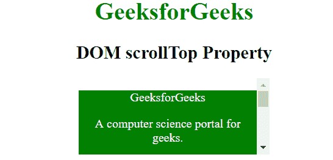

# HTML | DOM scrollTop 属性

> 原文:[https://www.geeksforgeeks.org/html-dom-scrolltop-property/](https://www.geeksforgeeks.org/html-dom-scrolltop-property/)

DOM **scrollTop** 属性用于返回或设置元素垂直滚动的像素数。如果元素的内容没有生成滚动条，那么它的 scrollTop 值为 0。

**语法:**

*   它返回 scrollTop 属性。

    ```html
    element.scrollTop
    ```

*   用于设置滚动顶部属性

    ```html
    element.scrollTop = value
    ```

其中**值**指定元素内容垂直滚动的像素数。
T3【注:

*   它的价值不能是负数。
*   如果指定的值大于最大滚动量，则该值被设置为最大值。

**示例-1:**

```html
<html>

<head>
    <title>HTML DOM scrollTop Property</title>
    <style>
        #div {
            height: 100px;
            width: 250px;
            overflow: auto;
            margin: auto;
        }

        #ele {
            height: 300px;
            background-color: green;
            color: white;
        }
    </style>
</head>

<body style="text-align: center;">
    <h1 style="color:green;">
            GeeksforGeeks
        </h1>

    <h2>
            DOM scrollTop Property
        </h2>

    <div id="div" onscroll="Geeks()">
        <div id="ele">
            <p>GeeksforGeeks</p>
            <p>A computer science portal for geeks.</p>
            <p>Geeks classes an extensive programme for geeks.</p>
        </div>
    </div>

    <p id="p"></p>

    <script>
        function Geeks() {
            var doc = document.getElementById("div");
            var x = doc.scrollTop;
            document.getElementById("p").innerHTML = 
            "Vertical scroll: " + x + "px";
        }
    </script>
</body>

</html>
```

**输出:**
**滚动前:**

**滚动后:**


**示例-2:**

```html
<html>

<head>
    <title>HTML DOM scrollTop Property</title>
    <style>
        #div {
            height: 100px;
            width: 250px;
            overflow: auto;
            margin: auto;
        }

        #ele {
            height: 300px;
            background-color: green;
            color: white;
        }
    </style>
</head>

<body style="text-align: center;">
    <h1 style="color:green;">
            GeeksforGeeks
        </h1>

    <h2>
            DOM scrollTop Property
        </h2>

    <button onclick="Geeks()">Scroll Div</button>
    <br>
    <br>

    <div id="div" onscroll="Geeks()">
        <div id="ele">
            <p>GeeksforGeeks</p>
            <p>A computer science portal for geeks.</p>
            <p>Geeks classes an extensive programme for geeks.</p>
        </div>
    </div>

    <script>
        function Geeks() {
            var elmnt = document.getElementById("div");
            elmnt.scrollTop = 50;
        }
    </script>
</body>

</html>
```

**输出:**
**点击按钮前:**

**点击按钮后:**

**支持的浏览器:**支持的浏览器 **scrollTop** 属性如下:

*   苹果 Safari
*   谷歌 Chrome
*   火狐浏览器
*   歌剧
*   微软公司出品的 web 浏览器