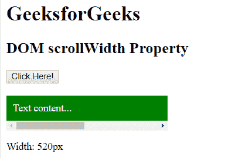

# HTML | DOM scrollWidth 属性

> 原文:[https://www . geesforgeks . org/html-DOM-scrollwidth-property/](https://www.geeksforgeeks.org/html-dom-scrollwidth-property/)

DOM **scrollWidth** 属性用于返回元素的宽度。此属性包括填充以及由于溢出而在屏幕上不可见的内容，但不包括边框、滚动条或边距。它是只读属性。

**语法:**

```html
element.scrollWidth
```

**返回值:**以像素为单位返回元素内容的宽度。

**示例:**

```html
<!DOCTYPE html>
<html>
    <head>
        <title>
            HTML DOM scrollWidth Property
        </title>
        <style>
            #box {
                width: 250px;
                overflow: auto;
            }

            #content {
                width: 500px;
                padding: 10px;
                background-color: green;
                color: white;
            }
        </style>

        <!-- script to find width of scroll -->
        <script>
            function Geeks() {
                var doc = document.getElementById("content");
                var x = doc.scrollWidth;
                document.getElementById ("p").innerHTML 
                        = "Width: " + x + "px";
            }
        </script>
    </head>

    <body>
        <h1>GeeksforGeeks</h1>

        <h2>
            DOM scrollWidth Property
        </h2>

        <button onclick="Geeks()">
            Click Here!
        </button>
        <br><br>

        <div id = "box">
            <div id = "content">
                Text content...
            </div>
        </div>

        <p id = "p"></p>
    </body>
</html>                    
```

**输出:**
**之前点击按钮:**

**之后点击按钮:**


**支持的浏览器:**T2 DOM scroll width 属性支持的浏览器如下:

*   谷歌 Chrome
*   微软公司出品的 web 浏览器
*   火狐浏览器
*   歌剧
*   旅行队