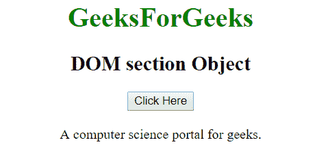
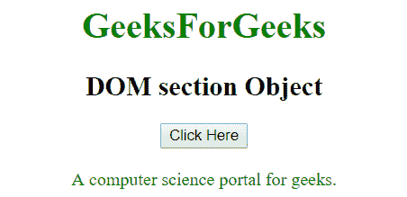
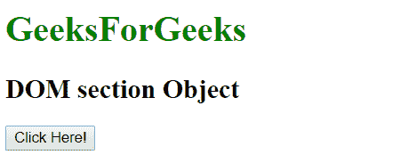
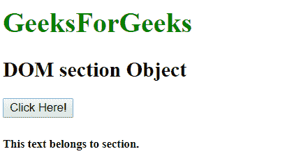

# HTML | DOM 节对象

> 原文:[https://www.geeksforgeeks.org/html-dom-section-object/](https://www.geeksforgeeks.org/html-dom-section-object/)

HTML DOM 中的 Section 对象用来表示 HTML section 元素。可以使用 getElementById()方法访问节元素。

**语法:**

```html
document.getElementById("id")
```

其中 id 被分配给

<section>标签。
**例 1:**</section>

## 超文本标记语言

```html
<!DOCTYPE html>
<html>
    <head>
        <title>
            HTML DOM section Object
        </title>
    </head>

    <body style = "text-align:center;">

        <h1 style = "color:green;" >
            GeeksForGeeks
        </h1>

        <h2>DOM section Object</h2>

        <button onclick = "Geeks()">
            Click Here
        </button>

        <br><br>

        <section id = "sec">
            A computer science portal for geeks.
        </section>

        <script>
            function Geeks() {
                var txt = document.getElementById("sec");
                txt.style.color = "green";
            }
        </script>
    </body>
</html>                   
```

**输出:**
**之前点击按钮:**



**点击按钮后:**



**示例 2:** 可以使用 document.createElement 方法创建截面对象。

## 超文本标记语言

```html
<!DOCTYPE html>
<html>
    <head>
        <title>
            HTML DOM section Object
        </title>
    </head>

    <body>
        <h1 style = "color:green;" >
            GeeksForGeeks
        </h1>

        <h2>DOM section Object</h2>

        <button onclick = "Geeks()">
            Click Here!
        </button><br>

        <script>
            function Geeks() {
                var x = document.createElement("SECTION");
                x.setAttribute("id", "sec");
                document.body.appendChild(x);

                var para = document.createElement("H5");
                var txt = document.createTextNode("This"
                    " text belongs to section.");
                para.appendChild(txt);
                document.getElementById("sec").appendChild(para);
            }
        </script>
</body>
</html>                   
```

**输出:**
**之前点击按钮:**



**点击按钮后:**



**支持的浏览器:**

*   谷歌 Chrome
*   Mozilla Firefox
*   边缘
*   旅行队
*   歌剧