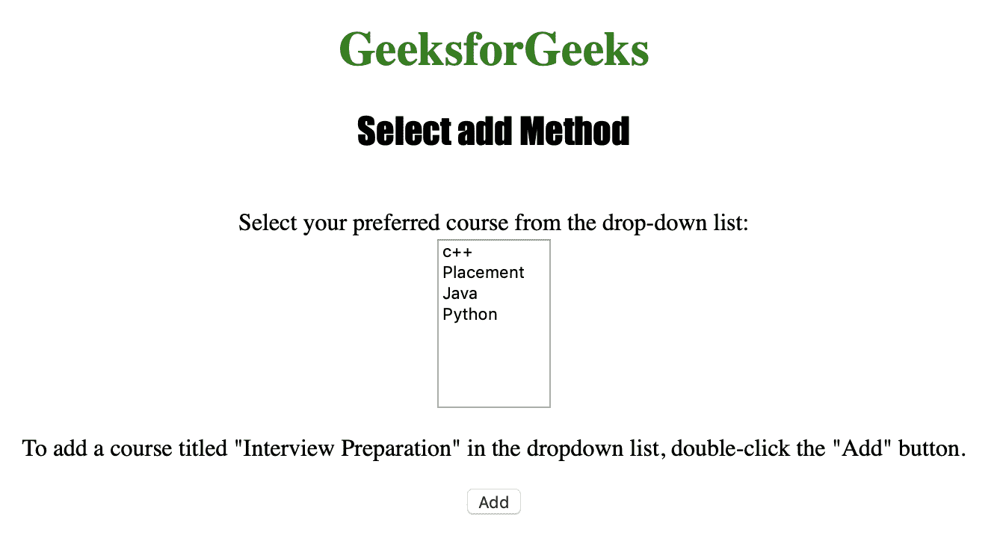
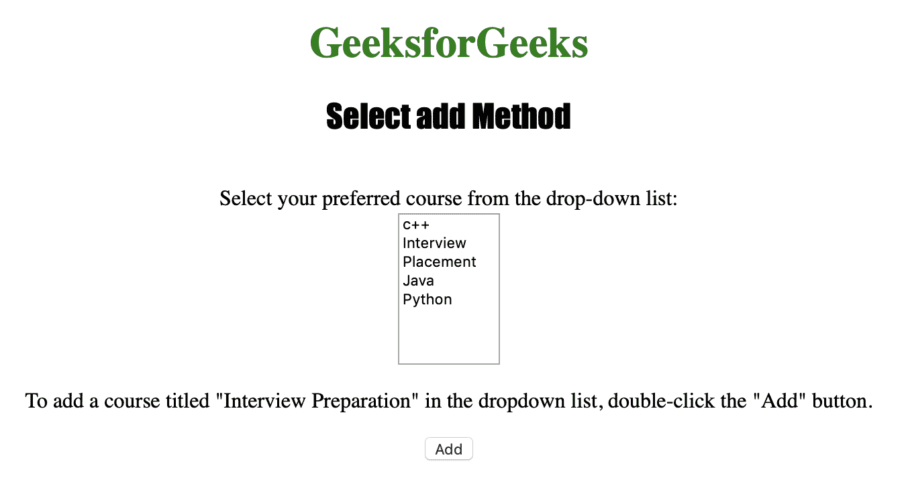

# HTML | DOM 选择添加方式

> 原文:[https://www.geeksforgeeks.org/html-dom-select-add-method/](https://www.geeksforgeeks.org/html-dom-select-add-method/)

**选择添加()**方法用于*在下拉列表*中添加一个选项。**选择添加()**方法接受索引号作为在所需位置添加新选项的参数。

**语法:**

```html
selectObject.add(option, index)
```

**属性值:**

*   **选项:**是强制参数，用于指定选项或 optgroup 元素。
*   **索引:**是一个可选参数，用于指定新选项元素的索引位置。

下面的程序说明了选择添加方法:

**1。在下拉列表的索引位置“1”添加“面试准备”课程。**

**输入:**

```html
<!DOCTYPE html>
<html>
<head> 
        <title>Select add Method in HTML</title> 
        <style> 
            h1 
            { 
                color:green; 
            } 
            h2
            {
                font-family: Impact;
            }
            body 
            { 
                text-align:center; 
            }
        </style> 
    </head>
<body>

<h1>GeeksforGeeks</h1> 
<h2>Select add Method</h2><br>

Select your preferred course from the drop-down list:<br>

<select id="myCourses" size="8">
  <option value="C++">c++</option>
  <option value="Placement">Placement</option>
  <option value="Java">Java</option>
  <option value="Python">Python</option>
</select>

<p>To add a course titled "Interview Preparation" in the 
dropdown list, double-click the "Add" button.</p>

<button ondblclick="My_list()">Add</button>

<script>

function My_list() 
{
   var d = document.getElementById("myCourses");
   var option = document.createElement("option");
   option.text = "Interview";
   d.add(option, d[1])
}

</script>

</body>
</html>                                        
```

**输出:**
**点击按钮前:**


**点击按钮后:**


**支持的浏览器:**

*   苹果 Safari
*   微软公司出品的 web 浏览器
*   火狐浏览器
*   谷歌 Chrome
*   歌剧