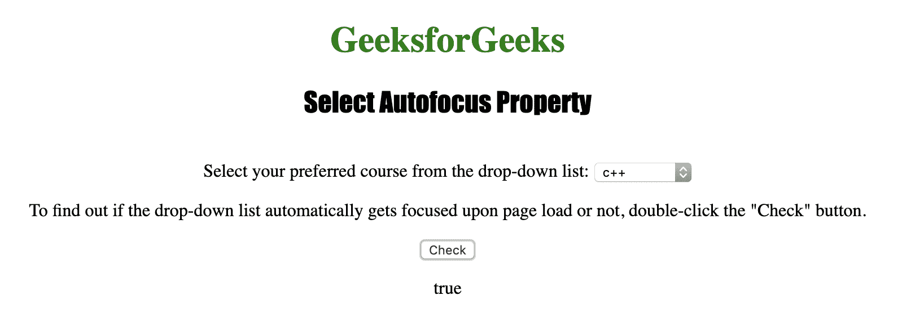

# HTML | DOM 选择自动对焦属性

> 原文:[https://www . geesforgeks . org/html-DOM-select-autofocus-property/](https://www.geeksforgeeks.org/html-dom-select-autofocus-property/)

HTML DOM 中的**选择自动对焦属性**用于**设置**或**返回**是否*下拉列表在页面加载时自动对焦，是否*。
如果下拉列表自动获得焦点，属性返回 true，否则返回 false。
选择自动对焦属性反映 HTML 自动对焦属性。
**返回自动对焦属性的语法**

```html
selectObject.autofocus
```

**设置自动对焦属性的语法**

```html
selectObject.autofocus = true|false
```

**房产价值**

*   **真:**下拉列表获得自动对焦。
*   **false :** 有默认值。下拉列表没有焦点。

**返回值:**返回一个布尔值，表示下拉列表是否有焦点。

下面的程序说明了选择自动对焦属性:
**示例-1:** 找出下拉列表是否在页面加载时自动获得焦点。

## 超文本标记语言

```html
<!DOCTYPE html>
<html>

<head>
    <title>
      Select Autofocus Property in HTML
  </title>
    <style>
        h1 {
            color: green;
        }

        h2 {
            font-family: Impact;
        }

        body {
            text-align: center;
        }
    </style>
</head>

<body>

    <h1>
      GeeksforGeeks
  </h1>
    <h2>
      Select Autofocus Property
  </h2>
    <br>
  Select your preferred course from the drop-down list:

    <select id="Courses" autofocus>
        <option value="C++">c++</option>
        <option value="Placement">Placement</option>
        <option value="Java">Java</option>
        <option value="Python">Python</option>
    </select>

<p>
      To find out if the drop-down list
      automatically gets focused upon page load
      or not, double-click the "Check" button.
  </p>

    <button onclick="My_list()">Check</button>

    <p id="test"></p>

    <script>
        function My_list() {
            var d =
                document.getElementById("Courses").autofocus;
            document.getElementById("test").innerHTML = d;
        }
    </script>

</body>

</html>
```

**输出:**
**点击按钮前:**


**点击按钮后:**



支持的浏览器: **DOM 选择自动对焦属性**支持的浏览器如下:

*   谷歌 Chrome
*   Internet Explorer 10.0 +
*   火狐浏览器
*   歌剧
*   旅行队