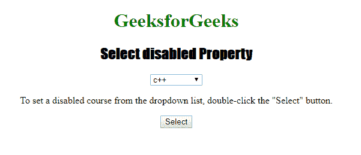

# HTML | DOM 选择禁用属性

> 原文:[https://www . geesforgeks . org/html-DOM-select-disabled-property/](https://www.geeksforgeeks.org/html-dom-select-disabled-property/)

HTML DOM 中的 **DOM 选择禁用属性**用于**设置**或**返回** *是否禁用下拉列表*。禁用的元素不可点击或不可用，通常在浏览器中默认为灰色。此属性用于反映 HTML 禁用属性。

**语法:**

*   它返回禁用的属性。

    ```html
    selectObject.disabled
    ```

*   它用于设置禁用属性。

    ```html
    selectObject.disabled = true|false
    ```

**属性值:**

*   **true:** 指定下拉列表将被禁用。
*   **false:** 指定下拉列表不会被禁用。

**返回值:**返回一个布尔值，表示下拉列表是否被禁用。

**示例:**本示例返回禁用的属性，

```html
<!DOCTYPE html>
<html>

<head>
    <title>
        Select disabled Property in HTML
    </title>
    <style>
        h1 {
            color: green;
        }

        h2 {
            font-family: Impact;
        }

        body {
            text-align: center;
        }
    </style>
</head>

<body>

    <h1> 
    GeeksforGeeks 
</h1>
    <h2> 
    Select disabled Property 
</h2>

    <select name="Courses Titles"
            id="myCourses" 
            disabled>
        <option value="C++">c++</option>
        <option value="Placement">Placement</option>
        <option value="Java">Java</option>
        <option value="Python">Python</option>
    </select>

    <p>
        To return a disabled course from the
      dropdown list, double-click the "Select" button.
    </p>

    <button ondblclick="My_list()">
        Select
    </button>
    <p id="sudo" 
       style="font-size:24px;
              color:green">
  </p>
    <script>
        function My_list() {
            var g = document.getElementById(
                "myCourses").disabled;
            document.getElementById("sudo").innerHTML = g;
        }
    </script>

</body>

</html>
```

**输出:**
**点击按钮前:**


**点击开启按钮后:**


**示例-2:** 本示例设置禁用属性。

```html
<!DOCTYPE html>
<html>

<head>
    <title>
        Select disabled Property in HTML
    </title>
    <style>
        h1 {
            color: green;
        }

        h2 {
            font-family: Impact;
        }

        body {
            text-align: center;
        }
    </style>
</head>

<body>

    <h1> 
    GeeksforGeeks 
</h1>
    <h2> 
    Select disabled Property 
</h2>

    <select name="Courses Titles" 
            id="myCourses" 
            disabled>
        <option value="C++">c++</option>
        <option value="Placement">Placement</option>
        <option value="Java">Java</option>
        <option value="Python">Python</option>
    </select>

    <p>
        To set a disabled course from the dropdown 
      list, double-click the "Select" button.
    </p>

    <button ondblclick="My_list()">
        Select
    </button>
    <p id="sudo"
       style="font-size:24px;
              color:green">
  </p>
    <script>
        function My_list() {
            var g = document.getElementById(
                "myCourses").disabled = "false";
            document.getElementById("sudo").innerHTML = g;
        }
    </script>

</body>

</html>
```

**输出:**
**点击按钮前:**


**点击按钮后:**


**支持的浏览器:**

*   谷歌 Chrome
*   Mozilla Firefox
*   边缘
*   歌剧
*   旅行队