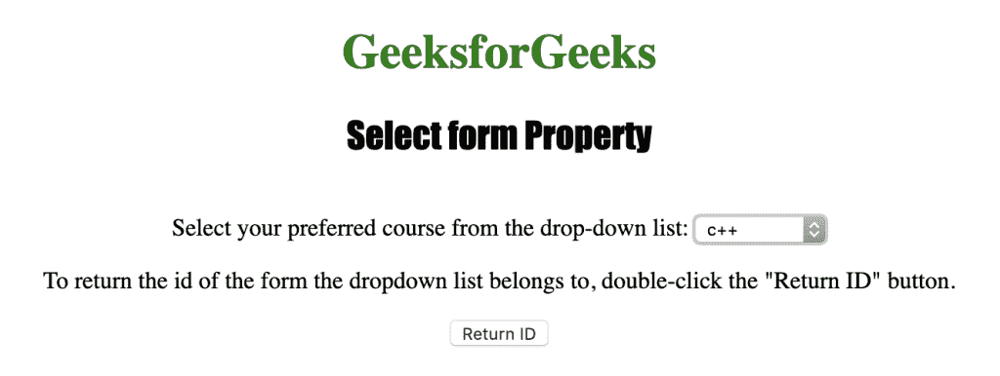
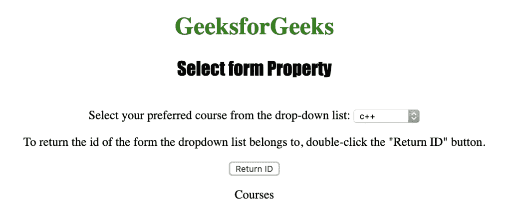

# HTML | DOM 选择表单属性

> 原文:[https://www . geesforgeks . org/html-DOM-select-form-property/](https://www.geeksforgeeks.org/html-dom-select-form-property/)

HTML DOM 中的**选择表单属性**用于返回对包含下拉列表的表单的引用。此属性在成功时返回一个表单对象，否则(下拉列表不在表单中)返回空值。
**语法:**

```html
selectObject.form
```

**返回值:**对包含下拉列表的表单元素的引用。如果下拉列表不在表单中，则返回 null

下面的程序说明了 HTML DOM 中的 Select form 属性:
**示例:**本示例使用 Select form 属性返回包含下拉列表的表单的 id。

## 超文本标记语言

```html
<!DOCTYPE html>
<html>

<head>
    <title>
        HTML DOM Select form Property
    </title>
</head>

<body style="text-align:center;">

    <h1 style="color:green;">
        GeeksforGeeks
    </h1>

    <h2 style="font-family: Impact;">
        Select form Property
    </h2>

    <form id="Courses">
        Select your preferred course from the drop-down list:
        <select id="myCourses" autofocus>
            <option value="C++">c++</option>
            <option value="Placement">Placement</option>
            <option value="Java">Java</option>
            <option value="Python">Python</option>
        </select>
    </form>

<p>
        To return the id of the form the dropdown list
        belongs to, double-click the "Return ID" button.
    </p>

    <button ondblclick="myGeeks()">
        Return ID
    </button>

    <p id="GFG"></p>

    <script>
        function myGeeks() {
        var d = document.getElementById("myCourses").form.id;
        document.getElementById("GFG").innerHTML = d;
        }
    </script>
</body>

</html>                                                       
```

**输出:**
**点击按钮前:**



**点击按钮后:**



**支持的浏览器:**T2 DOM 选择表单属性支持的浏览器如下:

*   苹果 Safari
*   微软公司出品的 web 浏览器
*   火狐浏览器
*   谷歌 Chrome
*   歌剧