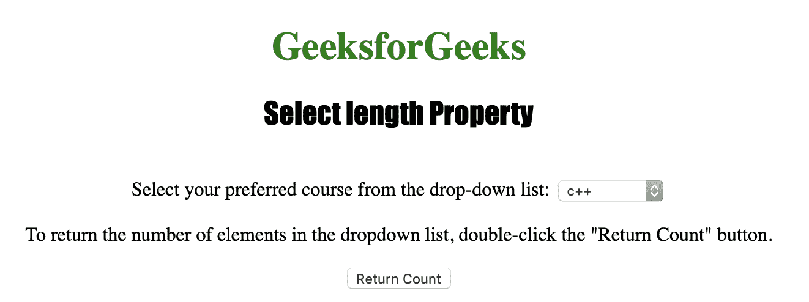
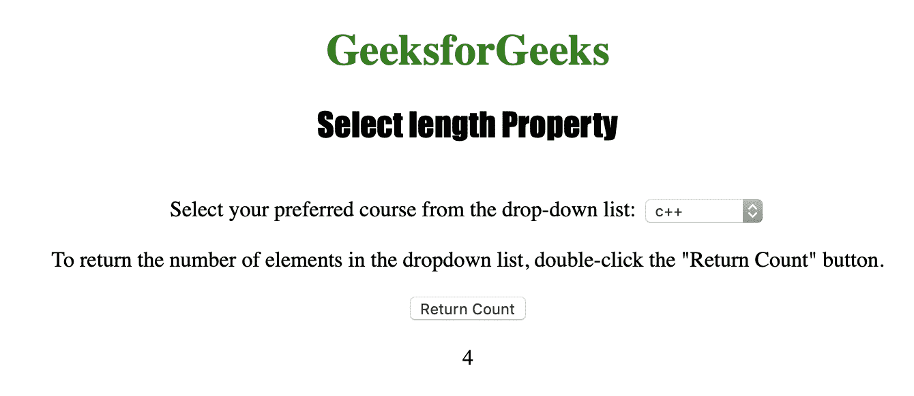

# HTML | DOM 选择长度属性

> 原文:[https://www . geesforgeks . org/html-DOM-select-length-property/](https://www.geeksforgeeks.org/html-dom-select-length-property/)

HTML DOM 中的**选择长度属性**用于返回下拉列表中<选项>元素的个数。此属性在成功时返回一个整数值，否则返回一个错误。
**语法:**

```html
selectObject.length
```

**返回值:**一个数字，代表在下拉列表中找到的<选项>元素的数量

下面的程序说明了 HTML DOM 中的 Select length 属性:
**示例:**本示例返回在下拉列表中找到的<选项>元素的数量。

## 超文本标记语言

```html
<!DOCTYPE html>
<html>

<head>
    <title>
        HTML DOM Select length Property
    </title>
</head>

<body style="text-align:center;">

    <h1 style="color:green;">
        GeeksforGeeks
    </h1>

    <h2 style="font-family: Impact;">
        Select length Property
    </h2>

    Select your preferred course from the drop-down list:

    <select id="myCourses">
        <option value="C++">c++</option>
        <option value="Placement">Placement</option>
        <option value="Java">Java</option>
        <option value="Python">Python</option>
    </select>

<p>
        To return the number of elements in
        the dropdown list, double-click the
        "Return Count" button.
    </p>

    <button ondblclick="myGeeks()">
        Return Count
    </button>

    <p id="GFG"></p>

    <!-- Script to use Select length Property -->
    <script>
        function myGeeks() {
            var d = document.getElementById("myCourses").length;
            document.getElementById("GFG").innerHTML = d;
        }
    </script>
</body>

</html>                                                       
```

**输出:**
**点击按钮前:**



**点击按钮后:**



**支持的浏览器:**T2 DOM 选择长度属性支持的浏览器如下:

*   苹果 Safari
*   微软公司出品的 web 浏览器
*   火狐浏览器
*   谷歌 Chrome
*   歌剧