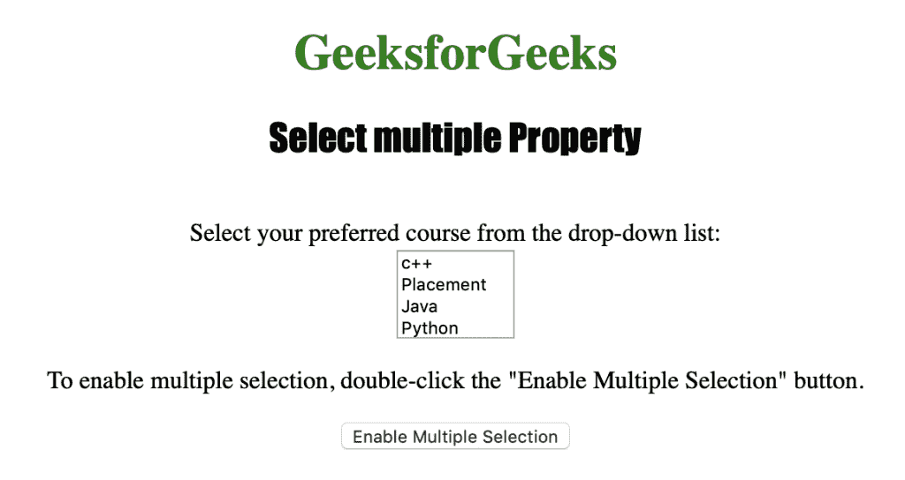
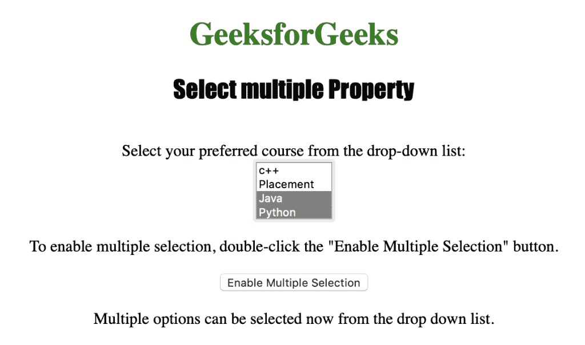

# HTML | DOM 选择多个属性

> 原文:[https://www . geesforgeks . org/html-DOM-select-multi-property/](https://www.geeksforgeeks.org/html-dom-select-multiple-property/)

HTML DOM 中的**选择多个属性**用于设置或返回是否可以从下拉列表中选择多个选项。如果启用了下拉列表中的多选，则返回 true，否则返回 false。
**语法:**

*   它返回 select multiple 属性。

```html
selectObject.multiple
```

*   它用于设置选择多个属性。

```html
selectObject.multiple = true|false
```

**属性值:**包含真或假两个值，用于指定下拉列表中的多选是否启用。

**返回值:**如果下拉列表中的多选被启用则返回真，否则返回假。
下面的程序说明了在 HTML DOM 中选择多个属性:
**示例:**本示例使用选择多个属性允许在下拉列表中进行多次选择。

## 超文本标记语言

```html
<!DOCTYPE html>
<html>

<head>
    <title>
        HTML DOM Select multiple Property
    </title>
</head>

<body style="text-align:center;">

    <h1 style="color:green;">
        GeeksforGeeks
    </h1>

    <h2 style="font-family: Impact;">
        Select multiple Property
    </h2><br>

    Select your preferred course from the drop-down list:<br>

    <select id="myCourses" size="4">
        <option value="C++">c++</option>
        <option value="Placement">Placement</option>
        <option value="Java">Java</option>
        <option value="Python">Python</option>
    </select>

<p>
        To enable multiple selection, double-click the
        "Enable Multiple Selection" button.
    </p>

    <button ondblclick="myGeeks()">
        Enable Multiple Selection
    </button>

    <p id="GFG"></p>

    <script>
        function myGeeks() {
            document.getElementById("myCourses").multiple
                    = true;
            document.getElementById("GFG").innerHTML
                    = "Multiple options can be selected now"
                    + " from the drop down list.";
        }
    </script>
</body>

</html>                                                   
```

**输出:**
**点击按钮前:**



**点击按钮后:**



**支持的浏览器:**T2 DOM 选择多属性支持的浏览器如下:

*   苹果 Safari
*   微软公司出品的 web 浏览器
*   火狐浏览器
*   谷歌 Chrome
*   歌剧