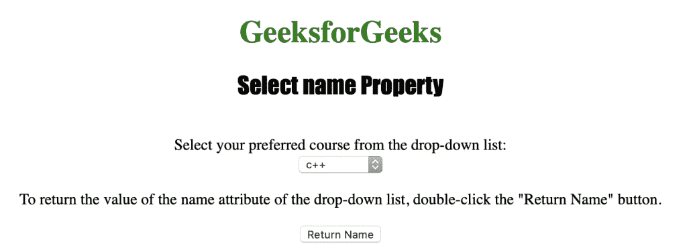
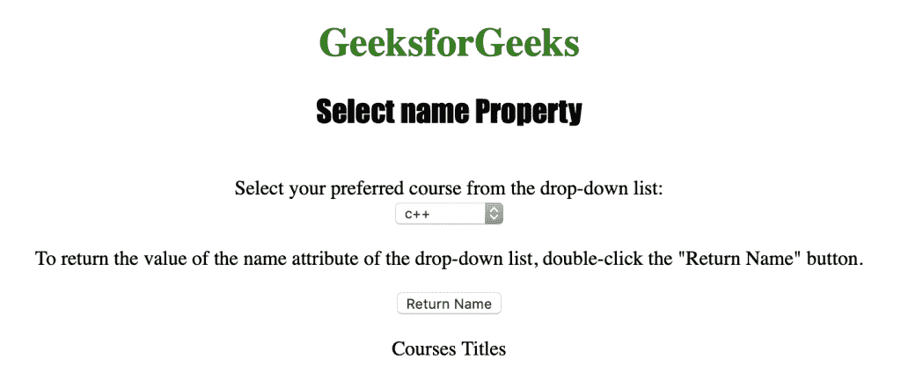

# HTML | DOM 选择名称属性

> 原文:[https://www . geesforgeks . org/html-DOM-select-name-property/](https://www.geeksforgeeks.org/html-dom-select-name-property/)

HTML DOM 中的**选择名称属性**用于设置或返回下拉列表的名称属性值。此属性返回一个表示下拉列表名称的字符串。

**语法:**

*   它返回 select name 属性。

    ```html
    selectObject.name
    ```

*   它用于设置 select name 属性。

    ```html
     selectObject.name = name 
    ```

**属性值:**包含单值**名称**，用于指定下拉列表的名称。

**返回值:**返回代表下拉列表名称的字符串值

下面的程序说明了在超文本标记语言中选择名称属性:

**示例:**本示例返回下拉列表的名称属性值。

```html
<!DOCTYPE html>
<html>

<head> 
    <title>
        HTML DOM Select name Property
    </title> 
</head>

<body style="text-align:center;">

    <h1 style="color:green;">
        GeeksforGeeks
    </h1> 

    <h2 style="font-family: Impact;">
        Select name Property
    </h2><br>

    Select your preferred course from the drop-down list:<br>

    <select name="Courses Titles" id="myCourses">
        <option value="C++">c++</option>
        <option value="Placement">Placement</option>
        <option value="Java">Java</option>
        <option value="Python">Python</option>
    </select>

    <p>
        To return the value of the name attribute of
        the drop-down list, double-click the 
        "Return Name" button.
    </p>

    <button ondblclick="myGeeks()">
        Return Name
    </button>

    <p id="GFG"></p>

    <!-- Script to use DOM Select name Property -->
    <script>
        function myGeeks() {
            var d = document.getElementById("myCourses").name;
            document.getElementById("GFG").innerHTML = d;
        }
    </script>
</body>

</html>                                                  
```

**输出:**
**点击按钮前:**

**点击按钮后:**


**支持的浏览器:**T2 DOM 选择名称属性支持的浏览器如下:

*   苹果 Safari
*   微软公司出品的 web 浏览器
*   火狐浏览器
*   谷歌 Chrome
*   歌剧